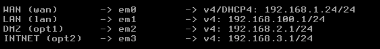
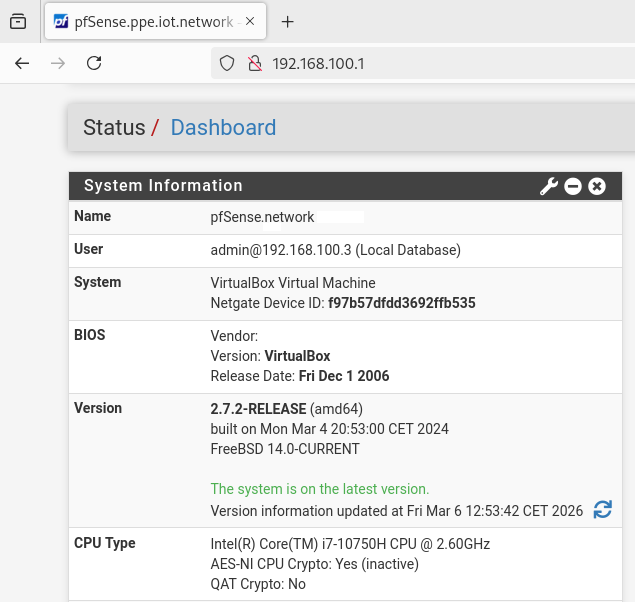
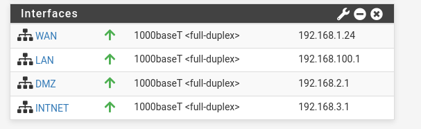
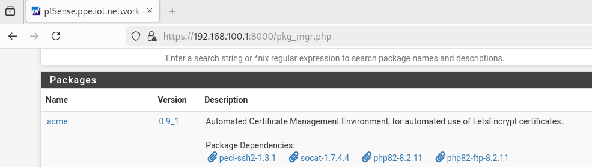
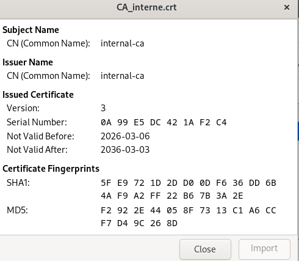
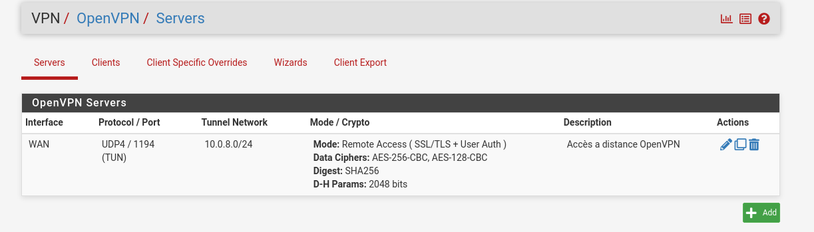
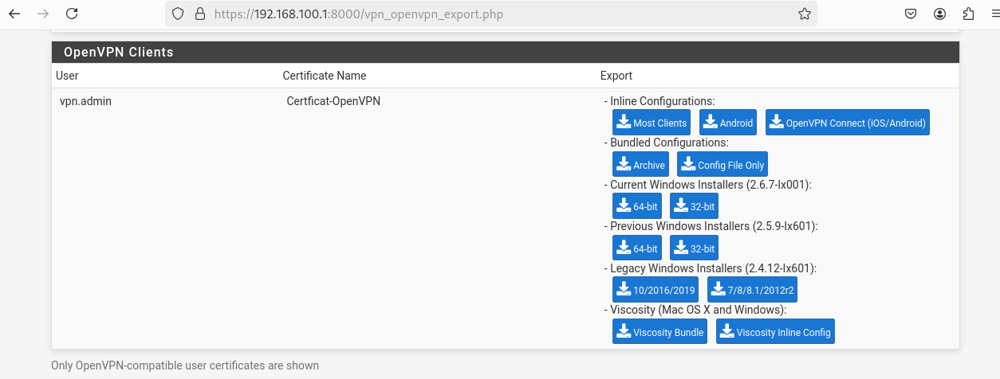

## Introduction ##

**PfSense** est un logiciel **open source de sécurité réseau** qui transforme un ordinateur en un pare-feu et routeur.  

Basé sur le système d'exploitation FreeBSD, il est reconnu pour sa **stabilité**, sa **fiabilité** et son architecture sécurisée.  Le nom « pfSense » provient de la combinaison de « pf » (Packet Filter), le pare-feu d'état à la base de FreeBSD, et « sense » (intelligent), reflétant son rôle de gardien du réseau.

## Segmentation Réseau Logique ##

La segmentation réseau logique sous pfSense repose principalement sur l'utilisation des VLAN (Virtual Local Area Networks) pour cloisonner les différents segments de votre réseau, renforçant ainsi la sécurité et la gestion du trafic.  

Cette approche permet de créer des sous-réseaux virtuels indépendants, en appliquant des règles de pare-feu spécifiques à chaque VLAN.

Le réseau WAN sert d’interface de communication avec Internet. Il permet aux différentes machines connectées aux réseaux internes d’accéder à l’extérieur tout en passant par le pare-feu pfSense.

Le réseau LAN est utilisé pour l’environnement informatique d’administration. C’est dans ce réseau que se trouve la machine d’administration, permettant à l’administrateur de superviser le trafic via l’interface graphique de pfSense et de gérer les règles de sécurité configurées dans le firewall.

Le réseau DMZ correspond à la zone la plus critique de l’infrastructure. Il héberge les serveurs Windows de l’organisation ainsi que le serveur Wazuh, chargé de collecter et de centraliser les logs et événements de sécurité provenant des différentes machines connectées.

Enfin, le réseau INTNET a pour objectif de simuler l’environnement informatique interne d’une organisation (services RH, ventes, support IT). Ce réseau constitue la cible principale du projet et permet de reproduire des scénarios d’attaque et de surveillance réalistes dans le cadre du laboratoire SOC.

## Connexion à l’interface graphique

Avant d’accéder à l’interface graphique de pfSense, il est nécessaire d’assigner une adresse IP à la machine d’administration.

Dans ce cas, l’adresse IP **192.168.100.3** a été configurée afin de permettre à la machine d’administration de se connecter au **réseau LAN**.

Une fois la connexion établie, il est important de vérifier que toutes les **interfaces réseau sont actives** et correctement configurées.

Cette vérification permet de confirmer que les différentes interfaces réseau sont **correctement mises en place**, garantissant ainsi le bon fonctionnement de l’architecture réseau.

## Mise en place du HTTPS

Afin de sécuriser l’accès à l’interface d’administration de pfSense, il est recommandé d’activer la connexion **HTTPS**.  
L’utilisation du protocole HTTPS permet de **chiffrer les communications entre l’administrateur et le firewall**, évitant ainsi l’interception des identifiants ou des données de configuration.

### Activation du protocole HTTPS

La première étape consiste à modifier le protocole d’accès à l’interface web de pfSense afin d’utiliser **HTTPS à la place de HTTP**.  
Cette configuration se réalise dans les paramètres d’administration de l’interface web.

Le passage à HTTPS permet de :

- sécuriser les connexions administrateur
- protéger les identifiants de connexion
- empêcher l’écoute du trafic réseau (sniffing)

### Configuration du certificat

Une fois HTTPS activé, pfSense utilise un **certificat SSL/TLS** pour chiffrer les communications.  
Dans un environnement de laboratoire, un **certificat auto-signé** peut être utilisé.

Ce certificat permet :

- d’assurer le chiffrement des communications
- d’authentifier le serveur pfSense
- d’éviter l’envoi d’informations sensibles en clair sur le réseau

## Mise en place d’OpenVPN

Dans le cadre de cette infrastructure, **OpenVPN** est utilisé afin de permettre un **accès distant sécurisé au réseau interne**.  
Un VPN (Virtual Private Network) crée un **tunnel chiffré** entre un client distant et le réseau de l’organisation, garantissant la confidentialité et l’intégrité des communications.

L’intégration d’OpenVPN dans pfSense permet ainsi aux administrateurs ou aux utilisateurs autorisés de **se connecter au réseau interne de manière sécurisée**, même depuis un réseau externe.

### Configuration du serveur VPN

La configuration du serveur OpenVPN dans pfSense consiste à :

- créer un **serveur VPN**
- définir le **réseau VPN attribué aux clients**
- configurer les **paramètres de chiffrement**
- associer les **certificats d’authentification**

L’utilisation de certificats permet d’assurer une **authentification forte** entre le client VPN et le serveur pfSense, limitant les risques d’accès non autorisé.

### Configuration du client VPN

Une fois le serveur configuré, les utilisateurs doivent disposer d’un **client OpenVPN** afin d’établir la connexion au réseau sécurisé.

Le client reçoit :

- un fichier de configuration VPN
- un certificat d’authentification
- les paramètres nécessaires à la connexion

Lorsque la connexion est établie, le client distant reçoit une **adresse IP appartenant au réseau VPN**, ce qui lui permet d’accéder aux ressources internes comme s’il était physiquement présent dans l’infrastructure.

