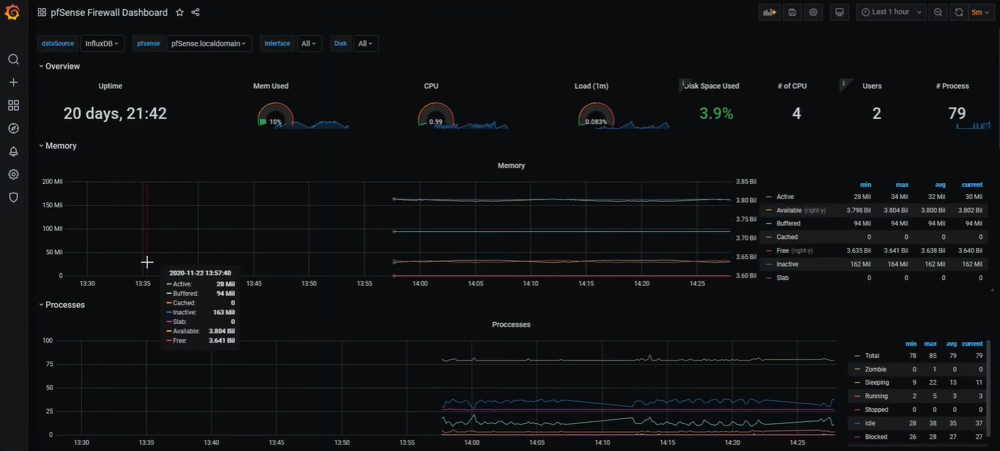

# Telegraf Monitoring Integration

## Présentation

**Telegraf** est un agent de collecte de métriques utilisé pour surveiller les performances des systèmes et des infrastructures réseau. Il est souvent utilisé avec **InfluxDB** pour le stockage des données et **Grafana** pour la visualisation.

Dans une infrastructure pfSense, Telegraf permet de collecter des informations sur :

- l’utilisation CPU
- l’utilisation mémoire
- le trafic réseau
- les performances du système

## Architecture

L’architecture classique repose sur :

1. **Telegraf Agent** installé sur le système
2. **InfluxDB** pour stocker les métriques
3. **Grafana** pour afficher les tableaux de bord

Les données sont collectées en temps réel et envoyées vers la base de données pour analyse.

## Visualisation des données

Les métriques collectées sont ensuite affichées dans Grafana sous forme de graphiques et tableaux de bord interactifs.

Cette visualisation permet aux administrateurs de surveiller facilement les performances du système et de détecter d’éventuels problèmes.