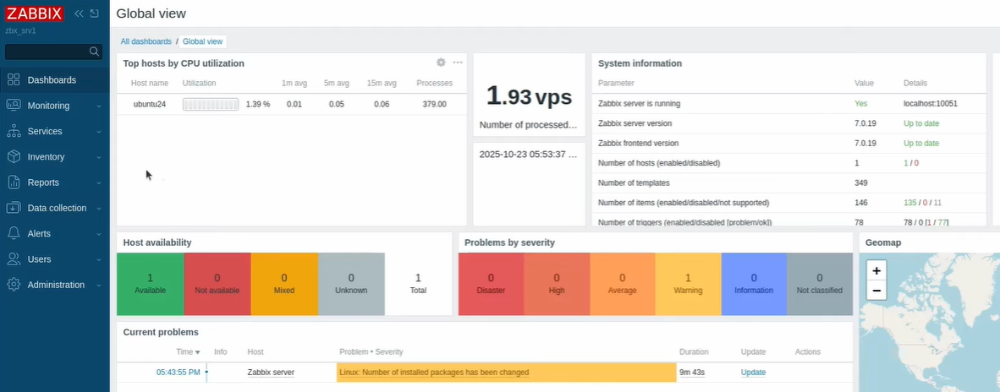
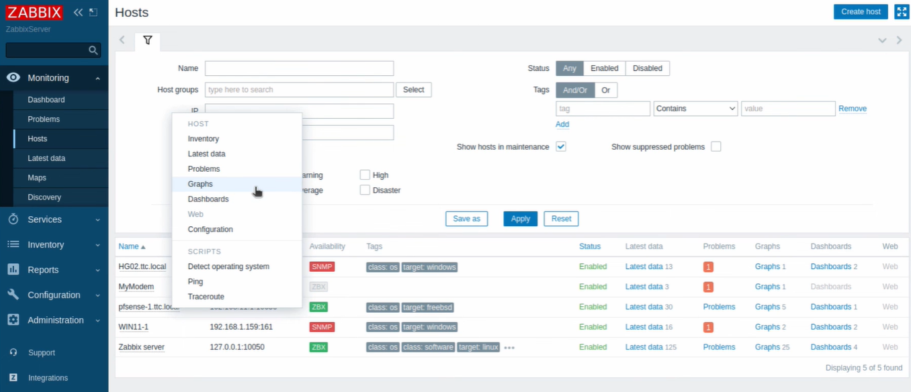

# Zabbix Agent Monitoring

## Présentation

**Zabbix Agent** est un composant du système de supervision **Zabbix** permettant de collecter des métriques système et de les transmettre au serveur Zabbix.

Dans un environnement réseau, l’agent permet de surveiller :

- les ressources système
- les services réseau
- l’utilisation CPU
- la mémoire
- les interfaces réseau

## Fonctionnement

L’agent Zabbix s’exécute sur la machine surveillée et communique avec le **Zabbix Server**. Les données collectées sont ensuite analysées et affichées dans l’interface de supervision.

Les administrateurs peuvent ainsi :

- surveiller l’état des équipements
- détecter les anomalies
- recevoir des alertes en cas de problème.

## Infrastructure de supervision

Le serveur Zabbix centralise les informations provenant des différents agents déployés dans l’infrastructure.

---

Cette architecture permet une **gestion centralisée de la supervision réseau**.