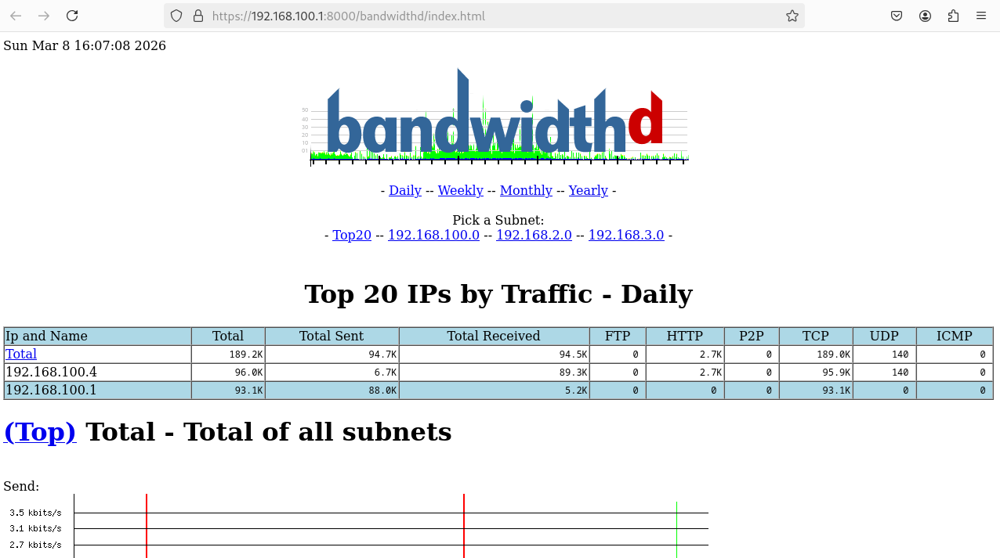
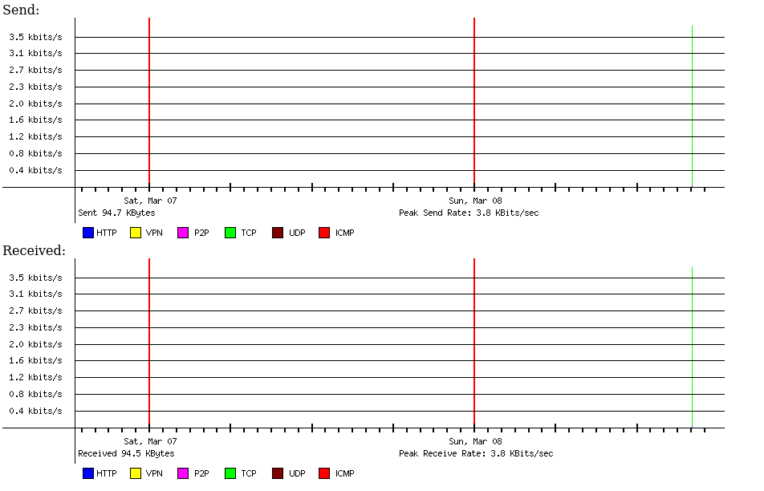

# BandwidthD – Analyse de la bande passante

## Présentation

**BandwidthD** est un outil de surveillance permettant d’analyser l’utilisation de la bande passante réseau. Il enregistre le trafic réseau et génère des rapports détaillés sur l’activité des différents hôtes.

Il permet notamment de :

- surveiller l'utilisation du réseau
- identifier les hôtes consommant le plus de bande passante
- analyser les tendances de trafic

## Analyse du trafic

BandwidthD génère des rapports statistiques montrant l’évolution de la consommation réseau sur différentes périodes.

 

Ces rapports permettent aux administrateurs réseau de mieux comprendre la distribution du trafic et d’optimiser l’utilisation de la bande passante.