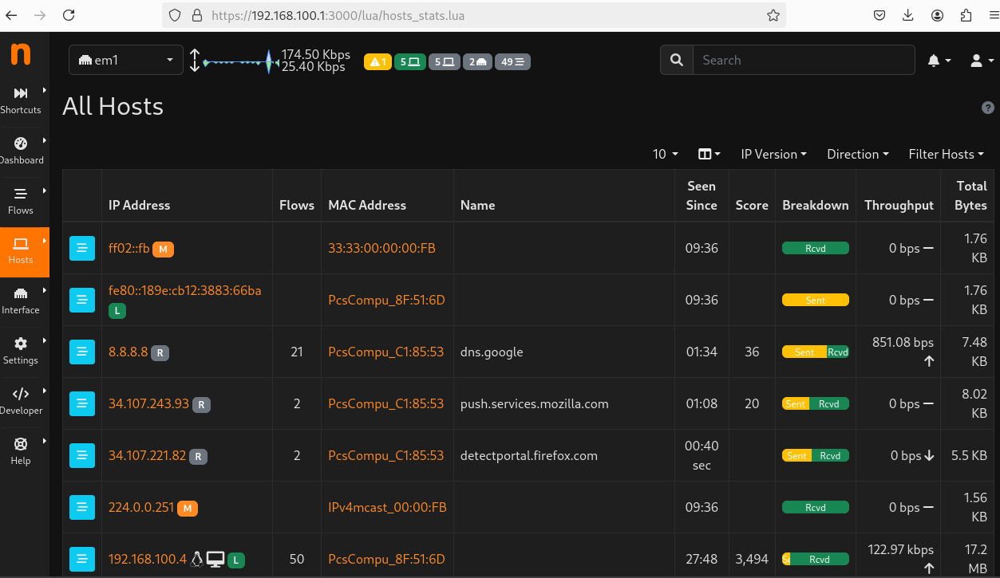
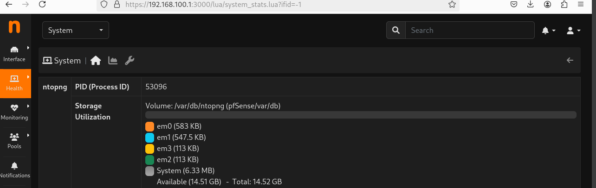
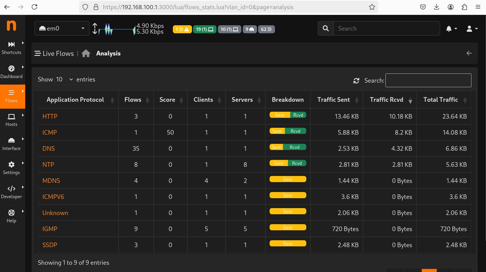

# ntopng – Analyse avancée du trafic réseau

## Présentation

**ntopng** est un outil avancé d’analyse du trafic réseau permettant d’obtenir une visibilité détaillée sur les communications entre les hôtes d’un réseau.

Il fournit des informations sur :

- les hôtes actifs
- les flux réseau
- les protocoles utilisés
- la consommation de bande passante

## Analyse des hôtes réseau

ntopng permet d’identifier les machines connectées au réseau et d’analyser leur activité.

## Surveillance des flux réseau

L’outil fournit également une visualisation en temps réel des flux réseau actifs.

Ces fonctionnalités permettent aux administrateurs réseau d’identifier rapidement les anomalies, les comportements suspects ou les usages excessifs de la bande passante.