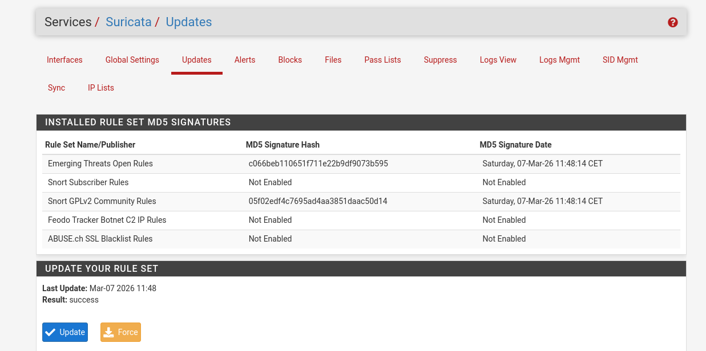
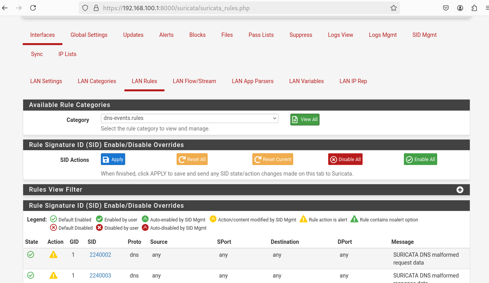
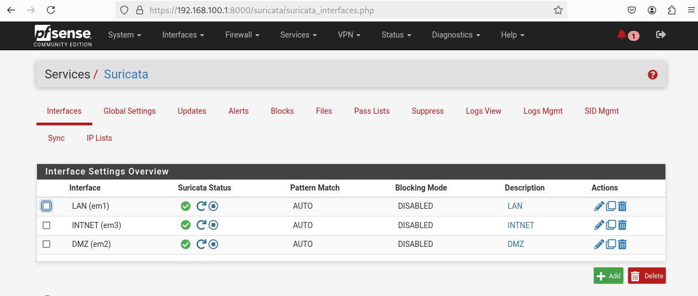
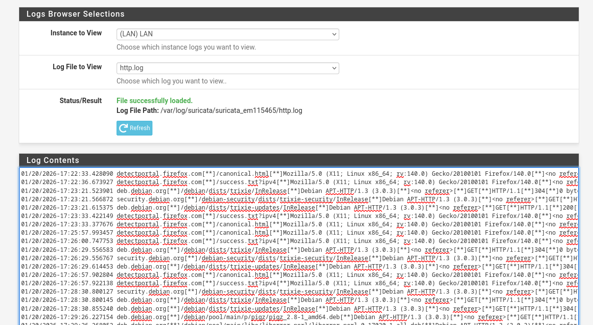
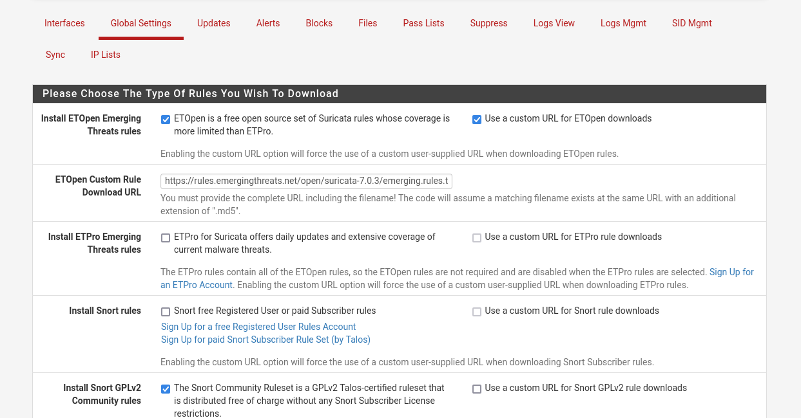

# Implémentation de Suricata sur pfSense

## 1. Présentation

**Suricata** est un moteur de détection et de prévention d’intrusion (**IDS/IPS**) open source capable d’analyser le trafic réseau en temps réel afin d’identifier des activités malveillantes.

Dans un environnement **pfSense**, Suricata permet :

- la **détection d’intrusions réseau**
- l’**analyse approfondie du trafic**
- le **blocage automatique des attaques**
- la surveillance des protocoles réseau (HTTP, DNS, TLS, etc.)

Suricata fonctionne selon deux modes principaux :

- **IDS (Intrusion Detection System)** : détection et alerte
- **IPS (Intrusion Prevention System)** : détection et blocage automatique

---

# 2. Mise à jour des règles

Les règles constituent la base du fonctionnement de Suricata.  
Elles permettent d’identifier les signatures connues d’attaques.

Les règles peuvent provenir de plusieurs sources :

- **Emerging Threats Open**
- **Emerging Threats Pro**
- **Snort Subscriber Rules**
- règles personnalisées

Le système permet de :

1. télécharger automatiquement les nouvelles règles
2. appliquer les mises à jour régulièrement
3. activer ou désactiver certaines catégories

---

# 3. Activation des règles DNS

Les règles DNS permettent de surveiller et détecter les activités malveillantes liées au protocole **DNS**.

Elles permettent notamment de détecter :

- communications avec des **domaines malveillants**
- **DNS tunneling**
- requêtes suspectes vers des serveurs de commande et contrôle (C2)
- exfiltration de données via DNS

Ces règles améliorent la capacité de Suricata à analyser les requêtes DNS transitant par le réseau.

---

# 4. Configuration des interfaces réseau

Suricata doit être activé sur les interfaces réseau à surveiller.

Les interfaces couramment surveillées sont :

- **WAN** : trafic entrant et sortant vers Internet
- **LAN** : trafic interne du réseau local
- **DMZ** : zones intermédiaires hébergeant des services publics

Pour chaque interface, plusieurs paramètres peuvent être configurés :

- mode **IDS ou IPS**
- niveau de journalisation
- activation du blocage automatique
- configuration des règles applicables

---

# 5. Analyse des journaux (logs)

Suricata génère des journaux détaillés permettant d’analyser les événements détectés sur le réseau.

Ces journaux contiennent :

- les alertes de sécurité
- les signatures déclenchées
- les adresses IP sources et destinations
- les protocoles utilisés
- l’horodatage des événements

Les logs permettent aux administrateurs :

- d’identifier les menaces
- d’analyser les comportements suspects
- de renforcer les politiques de sécurité

---

# 6. Blocage des menaces

En mode **IPS**, Suricata peut bloquer automatiquement les connexions identifiées comme malveillantes.

Le mécanisme de blocage fonctionne ainsi :

1. détection d’une signature d’attaque
2. génération d’une alerte
3. ajout automatique de l’adresse IP à la liste de blocage
4. interruption immédiate de la connexion

Cela permet de protéger le réseau contre :

- les tentatives d’intrusion
- les scans de ports
- les attaques web
- les communications avec des infrastructures malveillantes

---

# 7. Conclusion

L’intégration de **Suricata** dans pfSense permet de transformer le pare-feu en une solution avancée de **surveillance et de protection réseau**.

Grâce à :

- la mise à jour régulière des règles
- l’analyse du trafic DNS
- la surveillance des interfaces réseau
- l’analyse des journaux
- le blocage automatique des menaces

Suricata constitue un outil essentiel pour renforcer la sécurité d’une infrastructure réseau.