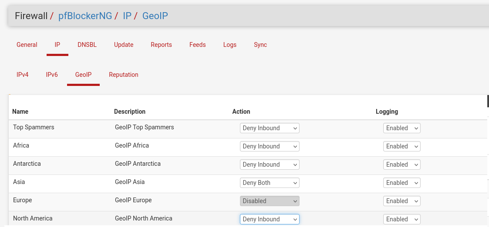
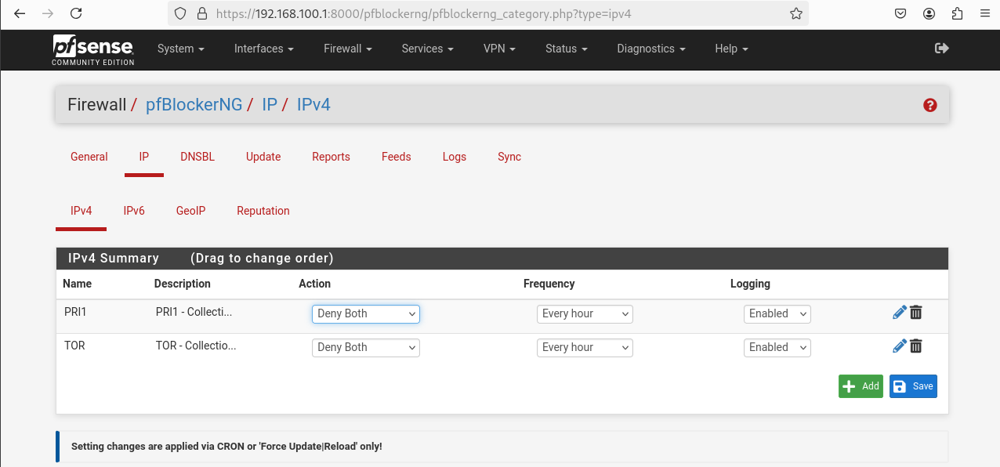
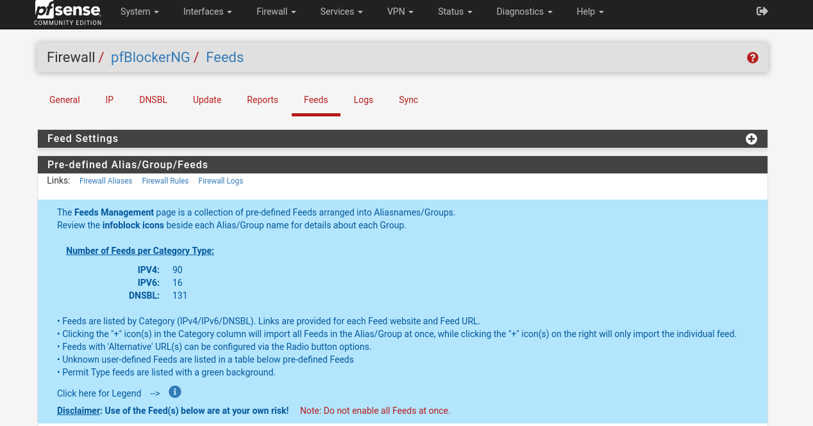

# pfBlockerNG – Filtrage IP et DNS

## 1. Présentation

**pfBlockerNG** est une extension du pare-feu **pfSense** permettant de bloquer automatiquement des adresses IP, des réseaux et des domaines malveillants.  
Il combine plusieurs mécanismes de protection :

- **Blocage IP (IPv4 / IPv6)** basé sur des listes de réputation
- **Blocage DNS (DNSBL)** pour empêcher l’accès aux domaines malveillants
- **Blocage géographique (GeoIP)** pour filtrer les connexions par pays
- **Automatisation des mises à jour** des listes de blocage

Cette solution est couramment utilisée pour renforcer la sécurité réseau en filtrant les menaces connues telles que :

- serveurs de **botnets**
- **malwares**
- **phishing**
- **publicités malveillantes**
- infrastructures d’attaque

---

# 2. Blocage GeoIP

Le module **GeoIP** permet de bloquer ou autoriser des connexions réseau en fonction du **pays d’origine des adresses IP**.

Principe de fonctionnement :

1. pfBlockerNG télécharge une base GeoIP
2. Les adresses IP sont classées par pays
3. Des règles de firewall sont automatiquement créées dans pfSense

Cas d’usage typiques :

- bloquer des régions à haut risque
- autoriser uniquement certains pays
- réduire la surface d’attaque

---

# 3. Filtrage par listes IP

pfBlockerNG peut importer des **listes d’adresses IP malveillantes** provenant de fournisseurs de sécurité.

Exemples de listes :

- Spamhaus
- AbuseIPDB
- Emerging Threats
- FireHOL

Fonctionnement :

1. Ajout d’une source de liste IP
2. Téléchargement automatique
3. Création de règles firewall
4. Blocage immédiat du trafic correspondant

Avantages :

- mise à jour automatique
- protection proactive
- intégration directe dans le firewall pfSense

---

# 4. Feeds prédéfinis

pfBlockerNG inclut plusieurs **feeds prédéfinis** facilitant la configuration rapide.

Ces feeds regroupent des listes de blocage classées par catégories :

- **Malware**
- **Botnets**
- **Spam**
- **Tracking**
- **Publicités**

L’administrateur peut simplement :

1. sélectionner un feed
2. activer le téléchargement
3. appliquer la politique de blocage

Cela permet une **mise en place rapide d’une protection réseau avancée**.

---

# 5. Avantages de pfBlockerNG

L’utilisation de pfBlockerNG apporte plusieurs bénéfices :

- amélioration de la **sécurité du réseau**
- réduction du **trafic malveillant**
- protection contre les **sites malveillants**
- filtrage automatisé et centralisé
- gestion simple depuis l’interface pfSense

---

# 6. Conclusion

pfBlockerNG est un outil puissant permettant d’ajouter des fonctionnalités avancées de **threat intelligence** au firewall pfSense.  

Grâce au filtrage **IP, DNS et GeoIP**, il constitue une solution efficace pour renforcer la sécurité d’un réseau d’entreprise ou domestique.