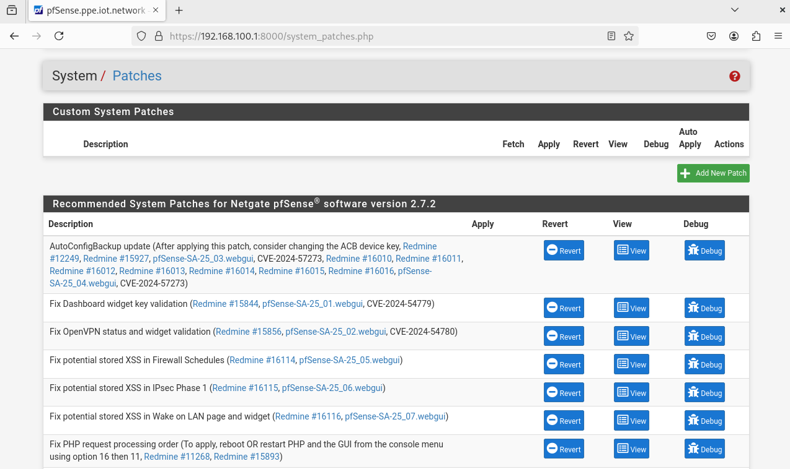
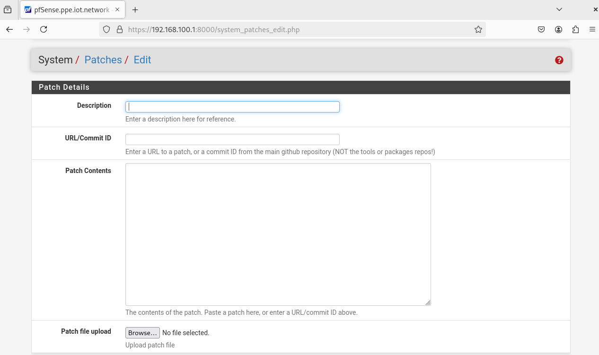
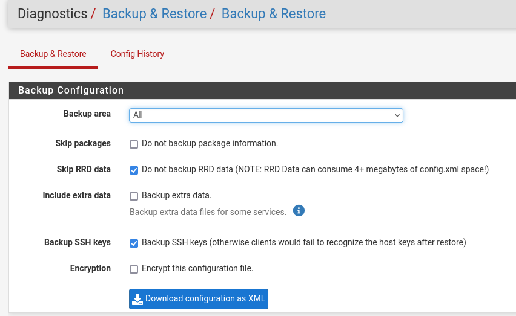

# Guide : Package System Patches sur pfSense

Le package **System Patches** est un outil pour les administrateurs pfSense. Il permet d'appliquer des correctifs de code (patches) directement sur le système sans attendre la prochaine mise à jour officielle du firmware.

---

##  Qu'est-ce que System Patches ?

Développé par Netgate, ce package permet de modifier les fichiers PHP et les scripts système qui constituent l'interface et les services de pfSense. Il sert de pont entre la découverte d'un bug et sa correction officielle dans une version future.

---

##  Avantages principaux

* **Réactivité** : Corrigez un bug critique dès qu'un patch est disponible sur le GitHub officiel.
* **Sécurité** : Appliquez des correctifs de sécurité mineurs sans redémarrer tout le système.
* **Flexibilité** : Vous pouvez "Appliquer" (Apply) ou "Révoquer" (Revert) une modification en un clic.
* **Persistance** : Les patches peuvent être configurés pour se réappliquer automatiquement après une mise à jour de pfSense.

---
### Paramètres clés :

| Champ | Description |
| :--- | :--- |
| **Description** | Nom explicite pour identifier le correctif. |
| **Patch ID** | Le hash du commit GitHub ou l'URL du fichier `.patch`. |
| **Path Strip Count** | Nombre de répertoires à ignorer dans le chemin du patch (généralement `1`). |
| **Base Directory** | Le répertoire racine pour l'application (par défaut `/`). |
| **Auto Apply** | Réapplique le patch automatiquement après une mise à jour du système. |

---

##  Procédure d'application d'un correctif

1.  **Récupération** : Identifiez le correctif sur le [Redmine de pfSense](https://redmine.pfsense.org) ou GitHub.
2.  **Ajout** : Cliquez sur **Add New Patch** et remplissez les informations (le Patch ID suffit souvent).
3.  **Test (Crucial)** : Cliquez sur le bouton **Test**. 
    * Si le statut est `OK`, le patch est compatible.
    * Si le statut est `Fails`, ne l'appliquez pas (risque de crash de l'interface).
4.  **Application** : Cliquez sur **Apply**.

---

##  Précautions et Bonnes Pratiques

> [!IMPORTANT]

> **Sauvegarde :** Effectuez toujours un backup de votre configuration avant d'appliquer un patch système.

---
