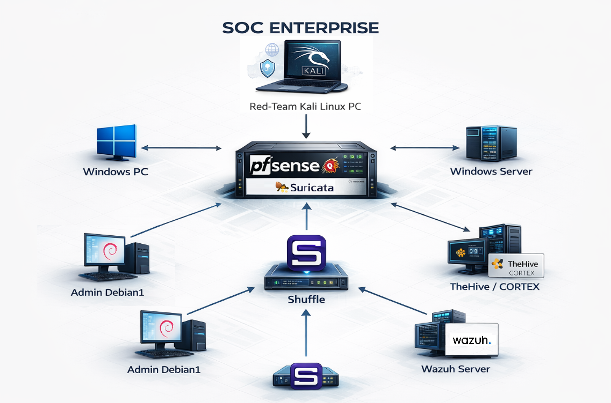

#  Projet SOC Automatisé 100 % Open Source

---

##  Objectif et démarche du projet

 *Espace image – *
 

L’objectif de ce projet est de **concevoir un SOC (Security Operations Center) réaliste, automatisé et 100 % open source**, proche des architectures utilisées en environnement professionnel.

La démarche est volontairement **méthodique, progressive et orientée métier SOC**. Le SOC est pensé non pas comme une simple juxtaposition d’outils, mais comme une **chaîne cohérente de détection, d’analyse, de décision et d’action**.

Les principes directeurs du projet sont :

* Simuler des attaques réalistes (Red Team)
* Centraliser et corréler les alertes (Blue Team)
* Transformer les alertes techniques en incidents exploitables
* Automatiser au maximum la réponse aux incidents
* Documenter chaque événement pour l’amélioration continue

---

##  Pourquoi une approche 100 % open source ?

Le choix du 100 % open source répond à des enjeux à la fois **techniques, pédagogiques et professionnels** :

* Reproduire un SOC réaliste sans dépendance à des solutions propriétaires
* Comprendre le fonctionnement interne des outils de sécurité
* Démontrer qu’un SOC efficace peut être construit avec des solutions libres
* Faciliter la reproductibilité (lab personnel, formation, portfolio)

Chaque outil a été sélectionné pour **son rôle précis dans la chaîne SOC**, et non pour sa popularité seule.

---

##  Les enjeux majeurs d’un SOC (Vision professionnelle)

Un SOC ne sert pas uniquement à « voir » des attaques. Il répond à des **besoins métiers critiques**.

###  Réduction du temps de détection (MTTD)

Identifier une intrusion (ex. Kali attaquant un poste Windows) le plus tôt possible afin d’éviter le vol ou le chiffrement des données.

###  Réduction du temps de réponse (MTTR)

Grâce à l’automatisation (Shuffle) et à l’expertise Cortex, l’objectif est de stopper une attaque en quelques secondes plutôt qu’en plusieurs heures.

###  Centralisation de la visibilité

Unifier les logs réseau (pfSense / Suricata) et système (Wazuh) pour éliminer les zones d’ombre dans l’infrastructure.

###  Gestion du bruit (Alert Fatigue)

Qualifier les alertes via TheHive afin que l’analyste SOC ne traite que les incidents réels.

###  Conformité et preuve

Répondre aux exigences réglementaires (ISO 27001, RGPD) en documentant rigoureusement chaque incident.

---

##  Objectifs d’apprentissage (Pourquoi ce lab ?)

 *Espace image – Apprentissage SOC / Blue Team*

Ce projet constitue un **parcours d’apprentissage complet du métier SOC**.

###  Maîtrise de la Cyber Kill Chain

Comprendre comment une attaque progresse (Reconnaissance, Exploitation, Post-Exploitation) et comment chaque brique SOC bloque une étape spécifique.

###  Compréhension de l’interopérabilité

Apprendre à faire communiquer des outils hétérogènes (pfSense, Wazuh, TheHive, Cortex, Shuffle) via APIs et flux de données.

###  Gestion des contraintes réelles

Optimiser une infrastructure de sécurité avec des ressources limitées (ex. 16 Go de RAM), contrainte fréquente en entreprise.

###  Adoption d’une posture Blue Team

Développer le réflexe de l’analyste SOC : investigation, corrélation, décision et documentation.

---

##  Architecture globale du SOC

 *Espace image – Schéma d’architecture globale du SOC*

Le SOC repose sur **quatre piliers fondamentaux** :

1. Détection (réseau et endpoint)
2. Centralisation et corrélation
3. Gestion des incidents
4. Automatisation de la réponse (SOAR)

---

##  Composants et justification des choix

 *Espace image – Vue globale des composants SOC*

### 1️⃣ pfSense + Suricata – Détection réseau

**Rôle SOC :** IDS / IPS réseau
**Étape SOC couverte :** Détection

**Justification :**
pfSense est un pare-feu open source robuste, largement utilisé en production. Suricata est un moteur IDS/IPS reconnu.

**Apport SOC :**

* Surveillance du trafic Kali → Windows
* Détection de scans et tentatives d’exploitation
* Première ligne de défense réseau

---

### 2️⃣ Wazuh – SIEM & EDR

**Rôle SOC :** SIEM / EDR central
**Étapes couvertes :** Surveillance, documentation

**Justification :**
Wazuh offre une visibilité complète endpoint et logs système dans un SOC open source.

**Apport SOC :**

* Centralisation des logs
* Détection comportementale
* Intégrité des fichiers

---

### 3️⃣ Windows 10 – Endpoint cible

**Rôle SOC :** Actif à protéger

**Justification :**
Windows est l’OS le plus répandu en entreprise.

**Apport SOC :**

* Génération d’événements réalistes
* Validation EDR et SIEM

---

### 4️⃣ Kali Linux – Simulation d’attaques

**Rôle SOC :** Red Team

**Justification :**
Simulation d’attaques réalistes et contrôlées.

---

### 5️⃣ TheHive – Case Management

**Rôle SOC :** Cœur opérationnel

**Justification :**
Transformation des alertes en incidents exploitables.

**Apport SOC :**

* Gestion des cases
* Collaboration analyste
* Historique et traçabilité

---

### 6️⃣ Cortex – Analyse & enrichissement

**Rôle SOC :** Expertise automatisée

**Apport SOC :**

* Enrichissement IP / fichiers / URLs
* Threat Intelligence
* Aide à la décision

---

### 7️⃣ Shuffle – SOAR

**Rôle SOC :** Automatisation

**Apport SOC :**

* Playbooks automatiques
* Blocage IP
* Réduction MTTR

---

##  Processus SOC en 10 étapes

 *Espace image – Diagramme du cycle SOC*

### Phase 1 – Préparation

1️⃣ Identification des actifs
2️⃣ Protection

### Phase 2 – Détection

3️⃣ Détection des menaces (Suricata)
4️⃣ Surveillance continue (Wazuh)

### Phase 3 – Réponse

5️⃣ Réponse automatisée (Shuffle)
6️⃣ Analyse & enrichissement (Cortex)
7️⃣ Case Management (TheHive)

### Phase 4 – Amélioration

8️⃣ Documentation
9️⃣ Conformité
🔟 Évaluation continue

---

##  Conclusion

Ce projet démontre qu’il est possible de construire un **SOC automatisé, cohérent et professionnel**, basé exclusivement sur des solutions open source.

Il met en avant :

* Une logique métier SOC
* L’automatisation de la réponse
* La réduction de la charge analyste
* Une amélioration continue de la posture de sécurité

Ce laboratoire constitue une **base solide pour un SOC Analyst / Blue Team**, aussi bien en contexte pédagogique que professionnel.
