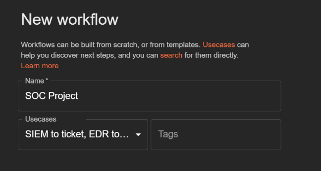
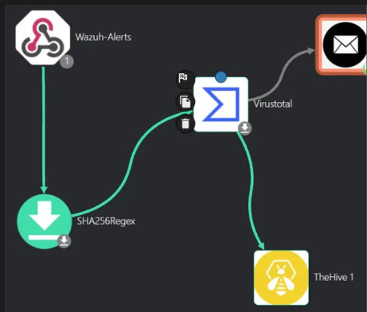
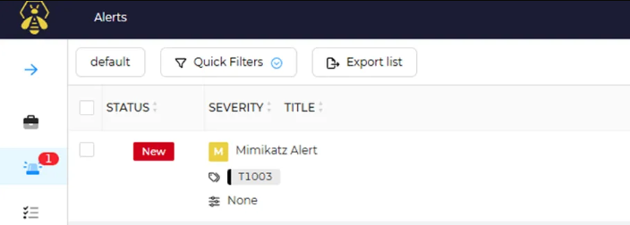

# Shuffle - SOAR (Security Orchestration, Automation & Response)


---

## Table des Matières

1. [Introduction](#introduction)
2. [Architecture Globale](#architecture-globale)
3. [Composants et Workflow](#composants-et-workflow)
4. [Installation et Configuration](#installation-et-configuration)
5. [Intégration avec Wazuh](#intégration-avec-wazuh)
6. [Intégration avec Cortex](#intégration-avec-cortex)
7. [Intégration avec TheHive](#intégration-avec-thehive)
8. [Monitoring et Debugging](#monitoring-et-debugging)
9. [Troubleshooting](#troubleshooting)
10. [Ressources](#ressources)

---

## Introduction

Shuffle est le **cœur de l'automatisation** du Projet SOC 100% Open Source. Elle orchestre tout le flux de travail d'automatisation des incidents :

```
Alerte Wazuh → Enrichissement Cortex → Création de Cas TheHive → Notification Email
```

**Rôle dans le SOC :**
- **Orchestration** des outils (Wazuh, Cortex, TheHive)
- **Automatisation** des workflows de réponse
- **Réduction du MTTR** (Mean Time To Respond)
- **Enrichissement** automatique des alertes

---

## Architecture Globale



```
┌────────────────────────────────────────────────────────────────────────┐
│                    SHUFFLE - SOAR ORCHESTRATION LAYER                  │
├────────────────────────────────────────────────────────────────────────┤
│                                                                        │
│   ┌──────────────────────────────────────────────────────────────┐     │
│   │  INPUT: WEBHOOKS (Wazuh Alerts)                              │     │
│   │  • Détection comportementale (EDR)                           │     │
│   │  • Règles personnalisées                                     │     │
│   │  • Événements Sysmon                                         │     │
│   └────────────────┬───────────────────────────────────────────┘       │
│                    │                                                   │
│                    ▼                                                 │
│   ┌────────────────────────────────────────────────────────────┐   │
│   │  PARSING & EXTRACTION (Regex)                              │   │
│   │  • Extraction SHA256                                       │   │
│   │  • Extraction IP/Domain                                    │   │
│   │  • Normalisation JSON                                      │   │
│   └────────────────┬───────────────────────────────────────────┘   │
│                    │                                                │
│                    ▼                                                │
│   ┌──────────────────────────────────────────────────────────────┐  │
│   │  ENRICHMENT PHASE (Cortex + External APIs)                   │  │
│   │  • VirusTotal (Hash Reputation)                              │  │
│   │  • IP Geolocation                                            │  │
│   │  • Domain WHOIS                                              │  │
│   └────────────────┬───────────────────────────────────────────┘   │
│                    │                                               │
│                    ▼                                               │
│   ┌──────────────────────────────────────────────────────────────┐ │
│   │  DECISION LOGIC                                              │ │
│   │  IF Severity > Threshold THEN                                │ │
│   │    ├─ Create Case in TheHive                                 │ │
│   │    ├─ Send Email Alert                                       │ │
│   │    └─ Add to Incident Queue                                  │ │
│   └────────────────┬───────────────────────────────────────────┘   │
│                    │                                              
│                    ▼                                              
│   ┌──────────────────────────────────────────────────────────────┐
│   │  OUTPUTS:                                                    │
│   │  • TheHive Cases (Case Management)                           │
│   │  • Email Notifications (Analysts)                            │
│   │  • Dashboard Logging (Audit Trail)                           │
│   └──────────────────────────────────────────────────────────────┘
│                                                                   
└───────────────────────────────────────────────────────────────────
```

---

## Composants et Workflow

### Architecture du Projet SOC


Le projet SOC se divise en **4 phases** :

1. **Préparation** : Identification des actifs, configuration des protections
2. **Détection** : Suricata (réseau), Wazuh (endpoint)
3. **Réponse** : Shuffle (automatisation), Cortex (enrichissement), TheHive (management)
4. **Amélioration** : Documentation, conformité, évaluation continue

### 1. Réception des Alertes Wazuh

**Source :** Wazuh Manager (voir dossier `/Wazuh` du projet)

**Événements déclencheurs :**
- Détection de processus malveillants (Mimikatz, etc.)
- Changements de fichiers critiques
- Tentatives d'accès non autorisé
- Comportements suspects (registry, powershell)

**Payload Webhook Wazuh → Shuffle :**

```json
{
  "AlertID": "1704710445-12345",
  "Agent": {
    "Id": "001",
    "Name": "Windows-10-Client",
    "IP": "192.168.1.105"
  },
  "Rule": {
    "Id": "100002",
    "Level": 7,
    "Description": "Suspicious Process Execution",
    "Group": "malware,process_creation"
  },
  "Timestamp": "2025-01-20T14:30:45Z",
  "Event": {
    "Image": "C:\\Windows\\System32\\mimikatz.exe",
    "CommandLine": "mimikatz.exe",
    "SHA256": "a1b2c3d4e5f6g7h8i9j0k1l2m3n4o5p6q7r8s9t0u1v2w3x4y5z6a7b8c9d0e1f",
    "ProcessID": "4752",
    "ParentProcessID": "1234"
  }
}
```

**Configuration d'intégration Wazuh :**

Fichier : `/var/ossec/etc/ossec.conf` (sur le Wazuh Manager)

```xml
<integration>
  <n>shuffle</n>
  <hook_url>https://[SHUFFLE_URL]/api/v1/webhooks/[WEBHOOK_ID]</hook_url>
  <api_key>[SHUFFLE_API_KEY]</api_key>
  <alert_format>json</alert_format>
  <group>malware,process_creation,anomaly,privilege_escalation</group>
  <event_source>sysmon,windows</event_source>
</integration>
```

### 2. Parsing et Extraction (Regex)

**Objectif :** Extraire les indicateurs de compromission (IOCs) pour enrichissement

**Regex Pattern SHA256 :**
```regex
[A-Fa-f0-9]{64}
```

**Données extraites par Shuffle :**

| Type | Pattern | Exemple |
|---|---|---|
| SHA256 Hash | `[A-Fa-f0-9]{64}` | `a1b2c3d4e5f6...` |
| IPv4 | `\b(?:\d{1,3}\.){3}\d{1,3}\b` | `192.168.1.105` |
| Domain | `(?:[a-z0-9](?:[a-z0-9-]{0,61}[a-z0-9])?\.)+[a-z]{2,}` | `malicious.com` |
| URL | `https?://[^\s]+` | `https://malicious.com/payload` |

### 3. Enrichissement via Cortex

**Flux d'enrichissement :**

```
SHA256 Hash
    ↓
VirusTotal API
    ↓
Reputation Score (0-97 détections)
    ↓
Malware Family + Tags
    ↓
MITRE ATT&CK Mapping
    ↓
Incident Scoring
```

**Exemple de réponse Cortex/VirusTotal :**

```json
{
  "reputation": {
    "status": "success",
    "data": {
      "last_analysis_stats": {
        "malicious": 45,
        "suspicious": 2,
        "undetected": 48,
        "timeout": 2
      },
      "detection_ratio": "45/97",
      "threat_level": "critical"
    },
    "tags": ["trojan", "credential-dumper", "mimikatz"],
    "threat_name": "Mimikatz"
  }
}
```

**Scoring Intelligence :**

```
if (VT_Detection > 40) → Severity = CRITICAL
else if (VT_Detection > 20) → Severity = HIGH
else if (VT_Detection > 5) → Severity = MEDIUM
else → Severity = LOW
```

### 4. Création de Cas dans TheHive

**Mapping Shuffle → TheHive :**

| Shuffle Field | TheHive Field | Type | Exemple |
|---|---|---|---|
| Alert.AlertID | Case Reference | String | `TH-2025-0042` |
| Agent.Name | Source | String | `Windows-10-Client` |
| Agent.IP | Asset | String | `192.168.1.105` |
| Timestamp | Date | DateTime | `2025-01-20T14:30:45Z` |
| Rule.Level | Severity | Int (1-4) | `3` (High) |
| Event.Image | Artifact | File | `C:\\Windows\\System32\\mimikatz.exe` |
| Event.SHA256 | Artifact | Hash | `a1b2c3d...` |
| VT.reputation | Tags | Array | `["trojan", "credential-dumper"]` |

**Template TheHive utilisé :**

```
Title: [SHUFFLE] Malware Detection - {Agent.Name}
Description: Suspicious process execution detected
Severity: {Calculated from VT Score}
Type: APT/Malware
Status: New
Tags: [malware, {malware_family}, {attack_technique}]
```

### 5. Notifications Email

**Modèle Email aux Analystes :**

```
Subject: [ALERT] Malware Detection - {Agent Name} - {Severity}

---
 SECURITY ALERT 
---

ALERT DETAILS:
├─ Computer: Windows-10-Client
├─ IP Address: 192.168.1.105
├─ Timestamp: 2025-01-20 14:30:45 UTC
├─ Severity: HIGH
└─ Status: Open

DETECTED ACTIVITY:
├─ Process: mimikatz.exe
├─ Path: C:\Windows\System32\
├─ File Hash: a1b2c3d4e5f6...
└─ Threat Type: Credential Dumper

THREAT INTELLIGENCE:
├─ VirusTotal Detection: 45/97 engines
├─ Threat Family: Mimikatz (Known malware)
├─ MITRE ATT&CK: T1003 (OS Credential Dumping)
└─ Risk Level: CRITICAL

ACTION REQUIRED:
1. Login to TheHive: https://thehive.soc-lab:9000
2. Review Case: TH-2025-0042
3. Initiate Containment
4. Document Investigation

---
Case: TH-2025-0042
Wazuh Dashboard: https://wazuh.soc-lab:443
---
```

---

## Installation et Configuration

### Prérequis

**Infrastructure :**
- Compte Shuffle (https://shuffle.io)
- API Keys : VirusTotal, TheHive, (optionnel) Shodan

**Réseau :**
- Accès depuis Wazuh vers Shuffle (HTTPS)
- Accès depuis Shuffle vers VirusTotal API
- Accès depuis Shuffle vers TheHive API

**Dépendances :**
- Docker (optionnel pour déploiement local)
- Node.js 14+ (pour versions self-hosted)

### Étape 1 : Configuration Wazuh

**Fichier à modifier :** `/var/ossec/etc/ossec.conf`

```xml

<integration>
  <n>shuffle</n>
  <hook_url>https://[SHUFFLE_URL]/api/v1/webhooks/[WEBHOOK_ID]</hook_url>
  <api_key>[SHUFFLE_API_KEY]</api_key>
  <alert_format>json</alert_format>
  <group>malware,process_creation,anomaly</group>
  <event_source>sysmon,windows</event_source>
</integration>
```

Redémarrer Wazuh Manager :
```bash
sudo /var/ossec/bin/wazuh-control restart
sudo /var/ossec/bin/wazuh-control status
```

**Vérifier les logs :**
```bash
tail -f /var/ossec/logs/integrations.log
```


### Étape 2 : Configuration Shuffle

#### 2.1 Créer un Workflow

1. **Login** : https://shuffle.io
2. **Menu** → New Workflow
3. **Workflow Name** : `SOC_Wazuh_to_TheHive`
4. **Start with** : Blank Workflow

#### 2.2 Ajouter le Trigger Webhook

1. **Click** → Add Node
2. **Select** → Webhook (Trigger)
3. **Configure :**
   - Type: `POST`
   - URL Path: `/api/v1/webhooks/[WORKFLOW_ID]`
   - Copy Webhook URL → insérer dans Wazuh

#### 2.3 Ajouter le Parsing (Regex)

1. **Add Node** → Utilities → Regex
2. **Configure :**
   - Input: `$webhook.Event.SHA256`
   - Pattern: `[A-Fa-f0-9]{64}`
   - Extraction: SHA256 Hash

#### 2.4 Ajouter Cortex/VirusTotal

1. **Add Node** → Cortex
2. **Configure :**
   - API Base URL: `http://cortex:9001`
   - API Key: `[CORTEX_API_KEY]`
   - Analyzer: `VirusTotal_v3`
   - Observable: `$regex.matches[0]` (SHA256)

#### 2.5 Ajouter TheHive Case Creation

1. **Add Node** → TheHive
2. **Configure :**
   - API URL: `https://thehive.soc-lab:9000`
   - API Key: `[THEHIVE_API_KEY]`
   - Title: `[SHUFFLE] {$webhook.Agent.Name} - Malware Detection`
   - Description: `Process: {$webhook.Event.Image} | Hash: {$regex.matches[0]}`
   - Severity: `3` (High)
   - Tags: `["malware", "$cortex.tags[0]"]`
   - Observables: Ajouter Hash + IP

#### 2.6 Ajouter Email Notification

1. **Add Node** → Email
2. **Configure :**
   - Provider: Gmail / SMTP Custom
   - To: `soc-team@company.com`
   - Subject: `[ALERT] Malware - {$webhook.Agent.Name}`
   - Body: HTML template (voir section 5)



### Étape 3 : Configurer les API Keys

#### 3.1 VirusTotal

1. Créer compte : https://www.virustotal.com
2. API Key : https://www.virustotal.com/gui/user/profile
3. Ajouter à Shuffle :
   ```
   Shuffle → Settings → API Keys
   Service: VirusTotal
   Key: [YOUR_API_KEY]
   ```

#### 3.2 TheHive

1. **Login TheHive** : https://thehive.soc-lab:9000
2. **Settings** → API Keys
3. **Create API Key** :
   - Name: `shuffle-integration`
   - Organization: `SOC Lab`
4. **Copy Key** → Ajouter à Shuffle



#### 3.3 Cortex

```
Shuffle → Settings → API Keys
Service: Cortex
Base URL: http://cortex:9001
API Key: [CORTEX_API_KEY]
```

### Étape 4 : Test du Workflow

**Option 1 : Test Manual dans Shuffle**

```
Workflows → SOC_Wazuh_to_TheHive
→ Test
→ Input JSON (copier payload Wazuh)
→ Execute
→ Check outputs à chaque node
```

**Option 2 : Trigger via Wazuh**

Sur le client Windows, exécuter une commande :
```powershell
cmd.exe /c "C:\Windows\System32\mimikatz.exe"
```

Vérifier :
- ✅ Alerte Wazuh générée
- ✅ Webhook reçu par Shuffle
- ✅ Case créé dans TheHive
- ✅ Email reçu par analyst

---

## Intégration avec Wazuh

### Configuration Avancée

**Dossier projet :** `/Wazuh`

**Fichiers importants :**
- `ossec.conf` : Configuration Wazuh
- `rules/local_rules.xml` : Règles personnalisées
- `decoders/` : Parseurs d'événements

### Règles Personnalisées pour Shuffle

**Exemple de règle Wazuh :**

```xml
<rule id="100002" level="7" ignore="frequency: same_field --&gt; field: Agent.ID, value: process_name --&gt; repeat_offsets: 30">
  <if_group>sysmon_event_1</if_group>
  <field name="Image">.*mimikatz.*</field>
  <description>Mimikatz detected execution</description>
  <group>malware,process_creation</group>
  <mitre>
    <id>T1003</id>
  </mitre>
</rule>
```

**Tagging pour Shuffle :**

```xml
<group name="malware,process_creation">
  <!-- Shuffle va recevoir cette alerte -->
</group>
```

### Sysmon Configuration

**Windows Client :**
- Sysmon ID 1 : Process Creation
- Sysmon ID 3 : Network Connection
- Sysmon ID 7 : Image/DLL Loaded
- Sysmon ID 11 : FileCreate
- Sysmon ID 12 : Registry Object add

---

## Intégration avec Cortex

### Analyzers Disponibles

**Dans le projet SOC :**

1. **VirusTotal**
   - Input: File Hash (SHA256, MD5)
   - Output: Detection ratio, malware families
   - Cost: Free tier 4 req/min

2. **MaxMind GeoIP**
   - Input: IP Address
   - Output: Geolocation, ISP, ASN
   - Cost: Free tier

3. **DNS Lookup**
   - Input: Domain
   - Output: IP Addresses, MX Records
   - Cost: Free

4. **WHOIS**
   - Input: Domain, IP
   - Output: Registrant info, creation date
   - Cost: Free

### Configuration Cortex dans Shuffle

```json
{
  "cortex_servers": [
    {
      "name": "local-cortex",
      "url": "http://cortex:9001",
      "key": "${CORTEX_API_KEY}",
      "cache_enabled": true,
      "cache_ttl_days": 1
    }
  ]
}
```

---

## Intégration avec TheHive

### Organisation et Permissions

**Structure TheHive :**

```
Organization: SOC Lab
├─ Service Account: shuffle-api
│  ├─ Permissions: [create_case, update_case, read_case]
│  └─ API Key: ${THEHIVE_API_KEY}
│
├─ Analyst Group
│  ├─ Permission: [read_case, update_case, comment]
│  └─ Users: [analyst1, analyst2]
```

### Case Naming Convention

**Format :** `[YEAR]-[SEQUENCE]`

**Exemples :**
- `TH-2025-0001` : Premier cas de 2025
- `TH-2025-0042` : 42ème cas malware
- `TH-2025-0127` : 127ème cas général

### Custom Fields

**Dans TheHive, ajouter des champs personnalisés :**

| Field | Type | Usage |
|---|---|---|
| `malware_family` | Text | Mimikatz, Emotet, etc. |
| `affected_hosts` | Tags | Hostname/IP du client |
| `vt_score` | Number | 0-97 (détections VT) |
| `attack_technique` | Tags | MITRE ATT&CK IDs |
| `remediation_status` | Select | Open/In Progress/Resolved |

---

## Monitoring et Debugging

### Logs Shuffle

**Accès aux exécutions :**

```
Shuffle Dashboard → Workflows → SOC_Wazuh_to_TheHive → Executions
```

**Checklist pour chaque exécution :**

- ✅ Webhook reçu
- ✅ Regex extraction réussie
- ✅ Cortex API répond (< 5s)
- ✅ TheHive case créé
- ✅ Email envoyé avec succès

### Dashboard Monitoring

**Créer un Workflow de Monitoring :**

```
Scheduler (Daily 08:00)
  ↓
Query Shuffle Logs
  ↓
Calculate Metrics
  ↓
IF Success_Rate < 95% THEN
  Send Alert Email
```

---

## Troubleshooting

### Webhook non reçu par Shuffle

**Diagnostic :**
```bash
tail -f /var/ossec/logs/integrations.log

curl -v https://[SHUFFLE_URL]/api/v1/webhooks/[WEBHOOK_ID]
```

**Solutions :**
1. Vérifier l'URL webhook dans Wazuh
2. Vérifier firewall/proxy bloquant HTTPS
3. Redémarrer Wazuh Manager
4. Vérifier logs Shuffle côté serveur

### VirusTotal API Error

**Diagnostic :**
```
Shuffle Workflow → VirusTotal Node → Check Error Message
```

**Causes courantes :**
- API key invalide
- Rate limit dépassé (4 req/min free tier)
- Hash mal formé

**Solution :**
```
Settings → API Keys → VirusTotal
├─ Verify Key
├─ Check Quota: https://www.virustotal.com/gui/user/profile
└─ Add delay between requests if needed
```

### TheHive Case Creation Failed

**Diagnostic :**
```bash
curl -H "Authorization: Bearer ${API_KEY}" \
  https://thehive.soc-lab:9000/api/v1/user
```

**Solutions :**
- Vérifier TheHive API Key
- Vérifier permissions du service account
- Vérifier existance de l'organisation
- Vérifier connectivité réseau

### Email non reçu

**Diagnostic :**
```
Shuffle Node → Email → Check Output
```

**Vérifier :**
- SMTP credentials
- Adresse email valide
- Pas dans spam/junk
- Logs SMTP serveur

---

## Optimisations et Best Practices

### Performance

```
✓ Utiliser conditional nodes pour éviter API calls inutiles
✓ Implémenter caching Cortex (TTL 24h)
✓ Limiter payload JSON à < 5MB
✓ Timeouts: 30s max par node
✓ Batch traitement si > 100 alerts/jour
```

### Sécurité

```
✓ Stocker API keys dans Vault Shuffle (encrypted)
✓ HTTPS obligatoire pour webhooks
✓ Valider signatures requêtes entrantes
✓ Rate limiting API (prevent abuse)
✓ Audit logs activés (compliance)
```

### Maintenance

```
✓ Monitoring uptime via healthchecks
✓ Alertes sur erreurs critiques (workflow failed)
✓ Backup workflow config (JSON export)
✓ Versionning changes (Git)
✓ Documentation changements (Changelog)
✓ Test workflows après updates
```

---

## Ressources

### Documentation Officielle

- **Shuffle** : https://docs.shuffle.io
- **Wazuh Integration** : https://documentation.wazuh.com/current/user-manual/manager/manual-integration.html
- **VirusTotal API** : https://developers.virustotal.com/reference
- **TheHive API** : https://docs.strangebee.com/thehive/


### Références Apprentissage

- **MITRE ATT&CK** : https://attack.mitre.org
- **TheHive Documentation** : https://docs.strangebee.com/thehive/

---

## Support et Contact

Pour toute question sur cette configuration Shuffle :

1. **Logs Shuffle** : Dashboard → Workflows → Executions
2. **Documentation** : https://docs.shuffle.io
3. **Problème GitHub** : Ouvrir issue sur le projet SOC


---
