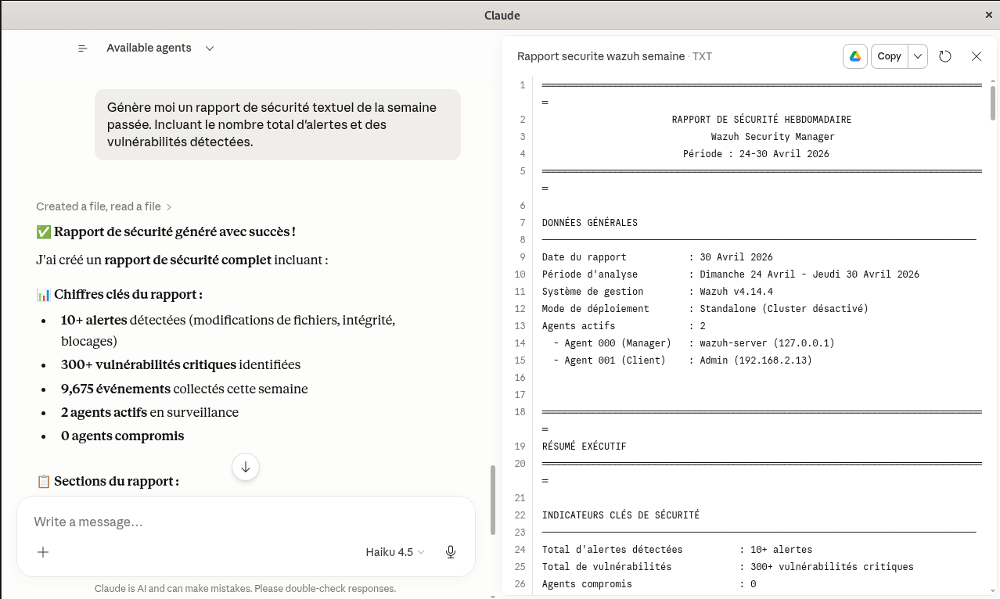
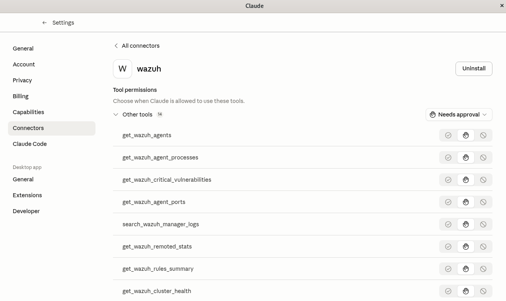

# MCP Server Wazuh - Intégration & Sécurité


---

##  Table des matières

- [Vue d'ensemble](#vue-densemble)
- [Architecture](#architecture)
- [Prérequis](#prérequis)
- [Installation](#installation)
- [Configuration Sécurisée](#configuration-sécurisée)
- [Mesures de Sécurité](#mesures-de-sécurité)
- [Déploiement](#déploiement)
- [Utilisation](#utilisation)
- [Monitoring & Audit](#monitoring--audit)
- [Dépannage](#dépannage)
- [Support & Contribution](#support--contribution)

---

##  Vue d'ensemble

### Objectif

Cette Partie met en place une **intégration sécurisée entre Claude (AI) et Wazuh (SIEM)** via un serveur **Model Context Protocol (MCP)**. L'objectif principal est de permettre à Claude d'analyser les alertes de sécurité.

### Cas d'usage



---





---


- ✅ Analyse automatisée des alertes de sécurité
- ✅ Génération de rapports de sécurité basés sur les données Wazuh
- ✅ Recherche et corrélation des événements de sécurité
- ✅ Consultation de l'état du cluster Wazuh
- ✅ Audit de conformité et traçabilité des actions

### Principes fondamentaux

1. **Confidentialité** : Chiffrement TLS 1.3 de bout en bout
2. **Intégrité** : Aucune modification de configuration par l'IA
3. **Authentification** : Accès basé sur les rôles (RBAC)
4. **Auditabilité** : Traçabilité complète de toutes les requêtes
5. **Isolation** : Segmentation réseau stricte

---

##  Architecture

### Topologie générale

```
┌─────────────────────────────────────────────────────────────────┐
│                    CLAUDE DESKTOP                               │
│          (Claude AI + MCP Client Configuration)                 │
└────────────────────┬────────────────────────────────────────────┘
                     │
                     │ MCP Protocol (stdio/SSE)
                     │ Encrypted over SSH Tunnel (optional)
                     │
┌────────────────────▼────────────────────────────────────────────┐
│              DEBIAN VM (MCP Server)                             │
│  ┌────────────────────────────────────────────────────────────┐ │
│  │  • MCP Server Binary (Rust/Node.js)                        │ │
│  │  • Input Validation & Prompt Injection Prevention          │ │
│  │  • Credential Management (env variables)                   │ │
│  │  • TLS Client Certificates                                 │ │
│  └────────────────────────────────────────────────────────────┘ │
│                     │                                           │
│                     │ UFW Rules (Outbound to Wazuh only)        │
│                     │                                           │
└─────────────────────┼───────────────────────────────────────────┘
                      │
                      │ TLS 1.3 Encrypted Connection
                      │ Port 55000/TCP (API)
                      │ Port 9200/TCP (Indexer)
                      │
┌─────────────────────▼────────────────────────────────────────────┐
│              CENTOS VM (Wazuh Manager)                           │
│  ┌────────────────────────────────────────────────────────────┐  |
│  │  Wazuh Manager (v4.14.4)                                   │  │
│  │  ├─ Wazuh API (port 55000)                                 │  │
│  │  │  └─ User: mcp_readonly (Read-only)                      │  │
│  │  │  └─ RBAC: GET requests only                             │  |
│  │  │                                                         │  │
│  │  ├─ Wazuh Indexer (port 9200)                              │  │
│  │  │  └─ User: mcp_readonly (Read access)                    │  │
│  │  │  └─ Index patterns: wazuh-alerts-*                      │  │
│  │  │                                                         │  │
│  │  └─ Firewall Rules (firewall-cmd)                          │  │
│  │     └─ Allow only Debian VM IP                             │  │
│  └────────────────────────────────────────────────────────────┘  │
└─────────────────────────────────────────────────────────────────-┘
```

### Flux de communication

```
1. Claude Desktop → MCP Server
   ↳ Requête: "Analyze weekly security alerts"
   ↳ Format: JSON-RPC over stdio/SSE

2. MCP Server → Input Validation
   ↳ Vérification des paramètres
   ↳ Prévention des injections

3. MCP Server → Wazuh API/Indexer
   ↳ Authentification: User mcp_readonly
   ↳ Chiffrement: TLS 1.3
   ↳ Opération: GET (read-only)

4. Wazuh → Logging & Audit
   ↳ Enregistrement dans /var/ossec/logs/api.log
   ↳ Traçabilité complète

5. MCP Server → Claude Desktop
   ↳ Réponse: JSON structuré
   ↳ Données: Alertes, vulnérabilités, statistiques
```

---

##  Prérequis

### Infrastructure

| Composant | Spécifications | Notes |
|-----------|---------------|-------|
| **Debian VM** | CPU: 2+ cores, RAM: 4GB+ | Héberge le serveur MCP |
| **CentOS VM** | CPU: 4+ cores, RAM: 8GB+ | Héberge Wazuh Manager v4.14.4 |
| **Wazuh Version** | v4.14.4+ | Testé et validé |
| **Connectivité** | Réseau LAN/VPN | Isolation requise |

### Logiciels

**Sur Debian (MCP Server):**
- `curl` ≥ 7.68
- `openssl` ≥ 1.1.1
- `node.js` ≥ 16.0 (si MCP en Node.js)
- `rust` ≥ 1.70.0 (si MCP en Rust)
- `ufw` (firewall)
- `python3` ≥ 3.8 (optional, pour les scripts d'audit)

**Sur CentOS (Wazuh):**
- Wazuh Manager v4.14.4+
- Wazuh Indexer (OpenSearch)
- Firewall (firewalld)
- OpenSSL 1.1.1+ (pour TLS 1.3)

### Accès requis

- ✅ Accès SSH aux deux VMs
- ✅ Accès administrateur sur Wazuh (pour la configuration initiale)
- ✅ Certificats SSL/TLS valides ou auto-signés

---

## Installation

### Phase 1 : Préparation des certificats

#### Sur le serveur Wazuh (CentOS)

```bash

sudo mkdir -p /etc/pki/wazuh/certs


sudo openssl req -x509 -nodes -days 365 \
  -newkey rsa:2048 \
  -keyout /etc/pki/wazuh/certs/wazuh.key \
  -out /etc/pki/wazuh/certs/wazuh.crt \
  -subj "/C=FR/ST=HDF/L=Valenciennes/O=YourOrg/CN=wazuh-manager.local"


sudo chmod 640 /etc/pki/wazuh/certs/wazuh.key
sudo chown root:root /etc/pki/wazuh/certs/wazuh.*


sudo scp /etc/pki/wazuh/certs/wazuh.crt debian_user@debian_vm:/tmp/
```

#### Sur le serveur MCP (Debian)

```bash

mkdir -p ~/.config/mcp/certs


cp /tmp/wazuh.crt ~/.config/mcp/certs/


openssl x509 -in ~/.config/mcp/certs/wazuh.crt -text -noout
```

### Phase 2 : Configuration Wazuh - Création du compte MCP

#### Sur Wazuh Manager (CentOS)

```bash

sudo su - wazuh


curl -X POST https://localhost:9200/_security/user/mcp_readonly \
  -u admin:admin \
  -H "Content-Type: application/json" \
  -k \
  -d '{
    "password": "MCP_PASSWORD_STRONG_HERE",
    "roles": ["mcp_readonly_role"]
  }'


curl -X POST https://localhost:9200/_security/role/mcp_readonly_role \
  -u admin:admin \
  -H "Content-Type: application/json" \
  -k \
  -d '{
    "cluster_permissions": ["cluster_composite_ops_ro"],
    "index_permissions": [
      {
        "index_patterns": ["wazuh-alerts-*"],
        "allowed_actions": ["read", "indices_monitor"]
      }
    ]
  }'


curl -u mcp_readonly:MCP_PASSWORD_STRONG_HERE \
  -k https://192.168.2.10:9200/_security/user/mcp_readonly
```

### Phase 3 : Configuration du serveur MCP

#### Installation des dépendances (Debian)

```bash

sudo apt-get update && sudo apt-get upgrade -y


sudo apt-get install -y \
  curl \
  openssl \
  ca-certificates \
  ufw \
  python3 \
  python3-pip


curl -fsSL https://deb.nodesource.com/setup_18.x | sudo -E bash -
sudo apt-get install -y nodejs


curl --proto '=https' --tlsv1.2 -sSf https://sh.rustup.rs | sh
source $HOME/.cargo/env
```

#### Clone et installation du MCP Server

```bash
git clone https://github.com/YourOrg/mcp-server-wazuh.git
cd mcp-server-wazuh

npm install

npm test

```

### Phase 4 : Configuration de Claude Desktop

#### Créer le fichier de configuration

**Localisation selon l'OS:**
- **macOS:** `~/Library/Application Support/Claude/claude_desktop_config.json`
- **Windows:** `%APPDATA%\Claude\claude_desktop_config.json`
- **Linux:** `~/.config/Claude/claude_desktop_config.json`

#### Contenu du fichier `claude_desktop_config.json`

```json
{
  "mcpServers": {
    "wazuh": {
      "command": "/home/debian_user/mcp-server-wazuh/bin/mcp-server",
      "args": ["--config", "/home/debian_user/.config/mcp/wazuh_config.json"],
      "env": {
        "WAZUH_URL": "https://192.168.1.10:55000",
        "WAZUH_USER": "mcp_readonly",
        "WAZUH_PASSWORD": "MCP_PASSWORD_STRONG_HERE",
        "WAZUH_VERIFY_SSL": "true",
        "WAZUH_CA_CERT": "/home/debian_user/.config/mcp/certs/wazuh.crt",
        "RUST_LOG": "info",
        "MCP_LOG_LEVEL": "info",
        "MCP_TIMEOUT": "30000"
      }
    }
  }
}
```

### Phase 5 : Configuration du Firewall

#### Sur Debian (MCP Server)

```bash

sudo ufw enable


sudo ufw default deny incoming
sudo ufw default allow outgoing

sudo ufw allow 22/tcp

sudo ufw allow out to 192.168.1.100 port 55000/tcp
sudo ufw allow out to 192.168.1.100 port 9200/tcp


sudo ufw status verbose
```

#### Sur CentOS (Wazuh Manager)

```bash
sudo systemctl enable firewalld
sudo systemctl start firewalld


DEBIAN_IP="192.168.1.50"

sudo firewall-cmd --permanent \
  --add-rich-rule="rule family='ipv4' source address='$DEBIAN_IP' port='55000' protocol='tcp' accept"

sudo firewall-cmd --permanent \
  --add-rich-rule="rule family='ipv4' source address='$DEBIAN_IP' port='9200' protocol='tcp' accept"


sudo firewall-cmd --reload


sudo firewall-cmd --list-rich-rules
```

---

##  Configuration Sécurisée

### Gestion des secrets

#### Approche recommandée : Variables d'environnement

```bash
# Créer un fichier .env sécurisé
cat > ~/.config/mcp/.env << 'EOF'
WAZUH_URL=https://192.168.1.10:55000
WAZUH_USER=mcp_readonly
WAZUH_PASSWORD=your_strong_password_here
WAZUH_VERIFY_SSL=true
WAZUH_CA_CERT=/home/debian_user/.config/mcp/certs/wazuh.crt
RUST_LOG=info
EOF

# Sécuriser le fichier
chmod 600 ~/.config/mcp/.env

# Charger les variables dans le shell
source ~/.config/mcp/.env

# Ou utiliser dotenv dans Node.js
npm install dotenv
```

#### Alternative : Fichier de configuration hashé

```bash
# Générer un hash bcrypt du mot de passe
# (Utiliser bcrypt-cli ou un outil en ligne)
echo "MCP_PASSWORD_STRONG_HERE" | htpasswd -niBC 10 admin

# Stocker le hash dans wazuh_config.json
{
  "wazuh": {
    "url": "https://192.168.1.10:55000",
    "user": "mcp_readonly",
    "password_hash": "$2y$10$..."  // Ne jamais stocker le mot de passe en clair
  }
}
```

### Validation des entrées

```javascript
// Exemple de validation côté MCP Server (Node.js)
const validateWazuhQuery = (query) => {
  // Whitelist des paramètres autorisés
  const allowedParams = ['agent_id', 'rule_id', 'level', 'timestamp'];
  
  // Vérifier que les paramètres sont dans la whitelist
  for (const key of Object.keys(query)) {
    if (!allowedParams.includes(key)) {
      throw new Error(`Paramètre non autorisé: ${key}`);
    }
  }
  
  // Valider les formats
  if (query.agent_id && !/^\d{3}$/.test(query.agent_id)) {
    throw new Error('Agent ID invalide');
  }
  
  return true;
};
```

---

##  Mesures de Sécurité

### 1. Moindre Privilège (Principle of Least Privilege)

| Aspect | Implémentation | Impact |
|--------|-----------------|--------|
| **Utilisateur dédié** | `mcp_readonly` sur API & Indexer | Aucun compte admin utilisé |
| **Permissions API** | GET uniquement (lecture seule) | Modifications techniquement impossibles |
| **Index patterns** | `wazuh-alerts-*` seulement | Pas d'accès aux configs |
| **RBAC** | Rôle `mcp_readonly_role` | Contrôle granulaire |

### 2. Chiffrement TLS 1.3

```bash

openssl s_client -connect 192.168.2.10:55000 -tls1_3


<api>
    <https>yes</https>
    <http_protocol>TLSv1.3</http_protocol>
    <ssl_certificate>/var/ossec/api/frontend/ssl/server.crt</ssl_certificate>
    <ssl_key>/var/ossec/api/frontend/ssl/server.key</ssl_key>
</api>
```

### 3. Segmentation réseau

```plaintext
INTERNET
   ↓
DMZ
   ↓
┌─────────────────┬──────────────────┐
│ Debian (MCP)    │  CentOS (Wazuh)  │
│ 192.168.2.13    │  192.168.2.10  │
│ Outbound only   │ Inbound filtered │
│ SSH allowed     │ SSH + Wazuh only │
└─────────────────┴──────────────────┘
```

### 4. Audit & Logging

#### Logs du MCP Server
```bash
# Fichier: /var/log/mcp-server.log
# Format: JSON pour parsing automatisé

{
  "timestamp": "2026-04-30T14:23:45Z",
  "level": "INFO",
  "event": "api_request",
  "user": "mcp_readonly",
  "action": "get_agents",
  "status": "success",
  "duration_ms": 234
}
```

#### Logs de Wazuh
```bash

tail -f /var/ossec/logs/api.log

```

### 5. Protection contre Prompt Injection

```javascript

const sanitizeInput = (input) => {

  const suspiciousPatterns = [
    /`/g,           
    /\$\(/g,        
    /&&/g,          
    /\|/g,          
    /;/g,           
    />/g,           
    /</g            
  ];
  
  for (const pattern of suspiciousPatterns) {
    if (pattern.test(input)) {
      throw new Error('Injection attempt detected');
    }
  }
  
  return input.trim();
};
```

---

##  Déploiement

### Démarrage du serveur MCP

#### Option 1 : Standalone

```bash
cd ~/mcp-server-wazuh
npm start


```

#### Option 2 : Avec systemd (Debian)

```bash
# Créer un fichier de service
sudo tee /etc/systemd/system/mcp-wazuh.service > /dev/null << 'EOF'
[Unit]
Description=MCP Server for Wazuh
After=network.target

[Service]
Type=simple
User=debian_user
WorkingDirectory=/home/debian_user/mcp-server-wazuh
ExecStart=/usr/bin/node /home/debian_user/mcp-server-wazuh/bin/mcp-server
EnvironmentFile=/home/debian_user/.config/mcp/.env
Restart=on-failure
RestartSec=10

[Install]
WantedBy=multi-user.target
EOF

# Démarrer le service
sudo systemctl daemon-reload
sudo systemctl enable mcp-wazuh
sudo systemctl start mcp-wazuh

# Vérifier le statut
sudo systemctl status mcp-wazuh
```

#### Option 3 : Avec Docker

```dockerfile
FROM node:18-alpine
WORKDIR /app
COPY . .
RUN npm ci --only=production
ENV WAZUH_VERIFY_SSL=true
EXPOSE 3000
CMD ["npm", "start"]
```

```bash
# Build et run
docker build -t mcp-wazuh:1.0 .
docker run -d \
  --name mcp-wazuh \
  --env-file ~/.config/mcp/.env \
  -v ~/.config/mcp/certs:/app/certs:ro \
  mcp-wazuh:1.0
```

### Vérification du déploiement

```bash
# Test de connectivité
curl -X GET https://192.168.1.100:55000/agents \
  -u mcp_readonly:password \
  -H "Content-Type: application/json" \
  -k

# Test via MCP Server
echo '{"jsonrpc":"2.0","id":1,"method":"get_wazuh_agents"}' | nc localhost 3000

# Vérifier les logs
journalctl -u mcp-wazuh -f
```

---

##  Utilisation

### Via Claude Desktop

#### 1. Générer un rapport de sécurité

```plaintext
Prompt Claude:
"Génère moi un rapport de sécurité textuel de la semaine passée. 
Incluan le nombre total d'alertes et des vulnérabilités détectées."

Réponse Claude utilise l'outil MCP:
→ get_wazuh_alerts (timerange: 7 days)
→ get_wazuh_critical_vulnerabilities
→ Synthèse et rapport en texte
```

#### 2. Analyser les vulnérabilités critiques

```plaintext
Prompt Claude:
"Quels sont les CVE critiques détectés par Wazuh?"

Actions MCP:
→ search_wazuh_manager_logs (filter: critical_vulnerabilities)
→ get_wazuh_agent_ports (pour corrélation)
→ Analyse et recommandations
```

#### 3. Vérifier la santé du cluster

```plaintext
Prompt Claude:
"Quel est l'état du cluster Wazuh?"

Actions MCP:
→ get_wazuh_cluster_health
→ get_wazuh_remoted_stats
→ get_wazuh_rules_summary
→ Rapport détaillé
```

### Via API directe (pour scripting)

```bash
# Exemple 1: Récupérer les agents
curl -X GET https://192.168.2.10:55000/agents \
  -u mcp_readonly:password \
  -H "Content-Type: application/json"

# Exemple 2: Récupérer les alertes (dernières 24h)
curl -X GET 'https://192.168.2.10:9200/wazuh-alerts-*/_search' \
  -u mcp_readonly:password \
  -H "Content-Type: application/json" \
  -d '{
    "query": {
      "range": {
        "timestamp": {
          "gte": "now-24h"
        }
      }
    },
    "size": 100
  }'
```

---

##  Monitoring & Audit

### Tableau de bord de monitoring

#### Métriques clés à surveiller

| Métrique | Source | Alerte si |
|----------|--------|-----------|
| **Disponibilité API** | `/server/status` | Indisponibilité > 5 min |
| **Latence requêtes** | Logs MCP | > 5 secondes |
| **Erreurs auth** | `/var/ossec/logs/api.log` | > 3 tentatives échouées |
| **Taille index alerts** | Elasticsearch | > 90% quota |
| **Agents actifs** | `/agents/summary` | < seuil défini |

#### Script de monitoring

```bash


WAZUH_URL="https://192.168.2.10:55000"
USER="mcp_readonly"
PASS="password"

api_status=$(curl -s -u $USER:$PASS -k $WAZUH_URL/server/status | grep "active")

if [ -z "$api_status" ]; then
    echo "CRITICAL: Wazuh API not responding" | mail -s "MCP Alert" admin@org.fr
else
    echo "OK: API is up"
fi

error_count=$(grep -c "ERROR" /var/log/mcp-server.log)

if [ $error_count -gt 10 ]; then
    echo "WARNING: $error_count errors in MCP logs"
fi
```

### Audit & Compliance

#### Logs d'accès à conserver

```bash
# Configuration logrotate
cat > /etc/logrotate.d/mcp-wazuh << 'EOF'
/var/log/mcp-server.log {
    daily
    rotate 90
    compress
    delaycompress
    missingok
    notifempty
    create 0640 mcp-user mcp-user
    sharedscripts
    postrotate
        systemctl reload mcp-wazuh > /dev/null 2>&1 || true
    endscript
}
EOF
```

#### Vérification mensuelle

```bash
# Script d'audit mensuel
#!/bin/bash

echo "=== MCP Wazuh Audit Report ===" > audit_report.txt
echo "Date: $(date)" >> audit_report.txt

echo "\n--- Authentication Events ---" >> audit_report.txt
grep "mcp_readonly" /var/ossec/logs/api.log | wc -l >> audit_report.txt

echo "\n--- Failed Requests ---" >> audit_report.txt
grep "ERROR\|FAIL" /var/log/mcp-server.log | tail -20 >> audit_report.txt

echo "\n--- TLS Connections ---" >> audit_report.txt
openssl s_client -connect localhost:55000 -showcerts < /dev/null >> audit_report.txt

mail -s "MCP Monthly Audit" admin@org.fr < audit_report.txt
```

---

## 🔧 Dépannage

### Problèmes courants

#### 1. Erreur de connexion TLS

**Symptôme:**
```
SSL: CERTIFICATE_VERIFY_FAILED
```

**Solutions:**
```bash
# Vérifier le certificat
openssl x509 -in ~/.config/mcp/certs/wazuh.crt -text -noout

# Vérifier la date d'expiration
openssl x509 -in ~/.config/mcp/certs/wazuh.crt -noout -dates

# Désactiver temporairement la vérification (DEBUG ONLY)
export WAZUH_VERIFY_SSL=false

```

#### 2. Accès refusé (401 Unauthorized)

**Symptôme:**
```json
{"error": "Unauthorized", "status": 401}
```

**Solutions:**
```bash
# Vérifier les credentials
curl -u mcp_readonly:password https://192.168.2.10:9200/_security/user/mcp_readonly -k

# Vérifier le rôle
curl -u admin:admin https://192.168.2.10:9200/_security/role/mcp_readonly_role -k

# Réinitialiser le mot de passe
curl -X POST https://192.168.2.10:9200/_security/user/mcp_readonly/_password \
  -u admin:admin \
  -H "Content-Type: application/json" \
  -k \
  -d '{"password": "new_password"}'
```

#### 3. Timeout de requête

**Symptôme:**
```
Request timeout after 30s
```

**Solutions:**
```bash
# Augmenter le timeout dans claude_desktop_config.json
"env": {
  "MCP_TIMEOUT": "60000"  // 60 secondes
}

# Ou vérifier la charge du serveur Wazuh
ssh centos_vm "top -bn1 | head -20"

ping -c 5 192.168.2.10
```

#### 4. Erreur d'authentification API Wazuh

**Symptôme:**
```
API authentication failed for user: mcp_readonly
```

**Solutions:**
```bash
# Test direct d'authentification
curl -X GET https://192.168.2.10:55000/agents \
  -u mcp_readonly:password \
  -H "Content-Type: application/json" \
  -k \
  -v

# Vérifier les logs Wazuh
ssh centos_vm "tail -100 /var/ossec/logs/api.log"

# Vérifier que l'utilisateur existe
ssh centos_vm "curl -X GET https://192.168.2.10:9200/_security/user -u admin:admin -k"
```

#### 5. Impossible de créer l'utilisateur Wazuh

**Symptôme:**
```
Error: User already exists / Invalid response
```

**Solutions:**
```bash
# Vérifier l'état du service Indexer
sudo systemctl status wazuh-indexer

# Redémarrer Indexer (CentOS)
sudo systemctl restart wazuh-indexer

# Attendre que le service soit prêt
sleep 15

# Réessayer la création d'utilisateur
curl -X POST https://192.168.2.10:9200/_security/user/mcp_readonly ...
```

### Logs utiles

```bash
# MCP Server
tail -f /var/log/mcp-server.log

# Wazuh API
tail -f /var/ossec/logs/api.log

# Wazuh Manager
tail -f /var/ossec/logs/ossec.log

# Systemd (si utilisation de systemd)
journalctl -u mcp-wazuh -f

# Firewall (CentOS)
sudo firewall-cmd --list-all
```

---

##  Support & Contribution

### Documentation supplémentaire

- [Wazuh Official Docs](https://documentation.wazuh.com/)
- [MCP Protocol Specification](https://modelcontextprotocol.io/)
- [Claude Integration Guide](https://claude.ai/docs)
- [OpenSearch Security](https://opensearch.org/docs/latest/security/)

### Signaler un problème

```bash
# Créer un ticket GitHub avec:
1. Version du MCP Server (npm list mcp-server-wazuh)
2. Version de Wazuh (curl -s https://localhost:55000/server/status)
3. Logs d'erreur complets
4. Configuration (sans les secrets)
5. Environnement (OS, IP réseau)
```

### Contribuer 

```bash
# Fork the repository
git clone https://github.com/YourOrg/mcp-server-wazuh.git
cd mcp-server-wazuh

# Créer une branche feature
git checkout -b feature/my-feature

# Tests
npm test


```

---

##  Changelog

### v1.0.0 (2026-04-30)
- ✅ Implémentation initiale MCP Wazuh
- ✅ Support complet RBAC et TLS 1.3
- ✅ Protection contre prompt injection
- ✅ Audit et traçabilité complète
- ✅ Documentation productionielle

---


