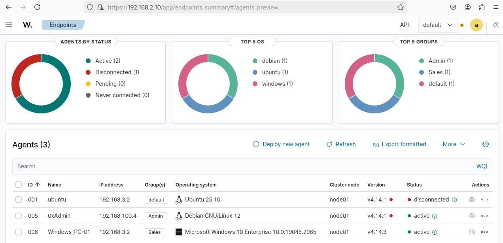
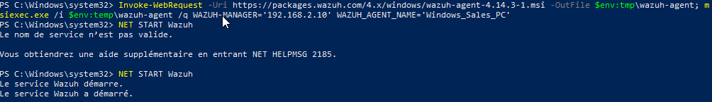
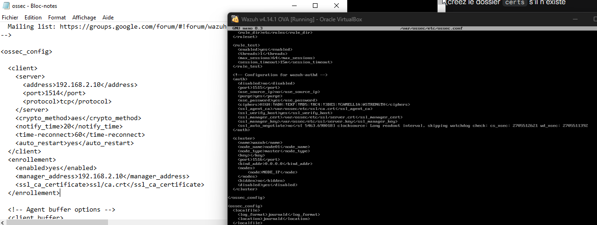
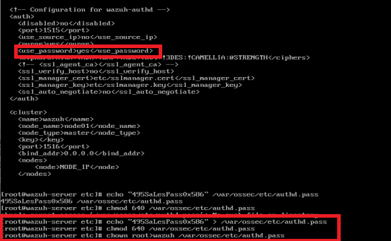
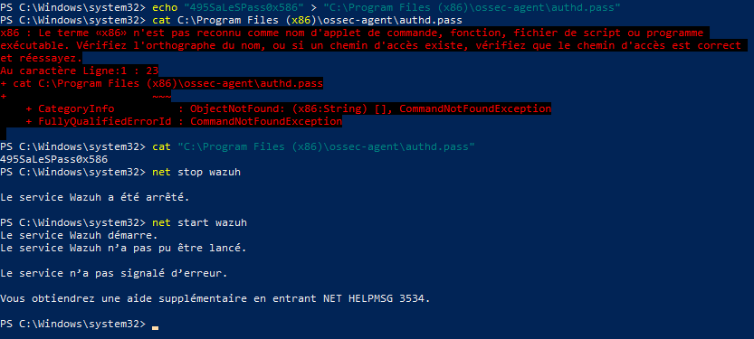
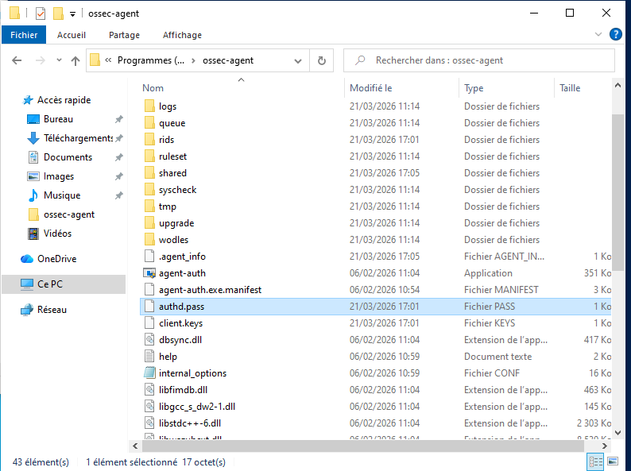
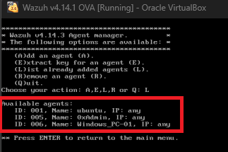

# Configuration des Agents Wazuh - Guide 



> **Documentation complète pour déployer et configurer les agents Wazuh dans votre infrastructure**

---

##  Table des matières

1. [Introduction](#introduction)
2. [Architecture Agent](#architecture)
3. [Installation](#installation)
4. [Configuration](#configuration)
5. [Authentification](#authentification)
6. [Vérification et Monitoring](#vérification)
7. [Dépannage](#dépannage)

---

## Introduction {#introduction}

### Qu'est-ce qu'un Agent Wazuh?

Un **agent Wazuh** est un composant léger et distribué qui s'exécute sur les endpoints (serveurs, postes de travail, appareils IoT) pour:

 **Collecter des données** de sécurité en temps réel  
 **Monitorer les fichiers** critiques (File Integrity Monitoring)  
 **Détecter les rootkits** et malwares  
 **Analyser les comportements** suspects  
 **Envoyer les alertes** au serveur Wazuh Manager


---

## Architecture Agent {#architecture}

### Architecture globale

```
┌────────────────────────────────────────────┐
│          ENDPOINTS (Avec Agent)            │
├────────────────────────────────────────────┤
│  • Windows PCs         ┌──────────────┐    │
│  • Linux Servers   ────│ Agent Wazuh  │    │
│  • macOS Devices       │              │    │
│  • IoT Devices         └──────────────┘    │
│                              │             │
│                    Port 1514 TCP (TLS)     │
│                              ▼             │
└────────────────────────────────────────────┘
                              │
                              │ (Secure Connection)
                              │
┌────────────────────────────────────────────┐
│         WAZUH MANAGER (Centralisé)         │
├────────────────────────────────────────────┤
│                                            │
│  ┌──────────────────────────────────────┐  │
│  │   • Décodage des logs                │  │
│  │   • Application des règles           │  │
│  │   • Génération d'alertes             │  │
│  │   • Stockage des données             │  │
│  └──────────────────────────────────────┘  │
│                                            │
└────────────────────────────────────────────┘
```

### Flux de communication

**Agent → Manager:**
1. **Collecte** les événements localement
2. **Chiffre** les données (AES-256)
3. **Envoie** vers le port 1514/TCP du manager
4. **Attend** la réception
5. **Relance** la connexion en cas de déconnexion

**Manager → Agent:**
1. **Reçoit** les données
2. **Décode** selon le type de log
3. **Applique** les règles de détection
4. **Génère** les alertes
5. **Stocke** dans Indexer

---

## Installation {#installation}

### 1️ Installation sur Windows

#### Prérequis Windows

```
 Windows 7 SP1 ou plus récent
 Windows Server 2008 R2 ou plus récent
 Droits administrateur OBLIGATOIRES
 Connexion réseau active
 Port 1514/TCP ouvert vers le manager
```

#### Étapes d'installation

##### Étape 1: Télécharger le MSI

```powershell
# Ouvrir PowerShell EN TANT QU'ADMINISTRATEUR

# Créer un répertoire temporaire
New-Item -ItemType Directory -Path "C:\Temp" -Force | Out-Null

# Télécharger l'agent
$url = "https://packages.wazuh.com/4.x/windows/wazuh-agent-4.7.0-1.msi"
Invoke-WebRequest -Uri $url -OutFile "C:\Temp\wazuh-agent.msi"

Write-Host " Agent téléchargé: C:\Temp\wazuh-agent.msi"
```

##### Étape 2: Installer l'agent





**Paramètres expliqués:**

| Paramètre | Exemple | Signification |
|-----------|---------|--------------|
| `WAZUH_MANAGER` | 192.168.2.10 | IP du serveur Wazuh Manager |
| `WAZUH_AGENT_NAME` | WIN-CLIENT-01 | Nom unique de l'agent |
| `WAZUH_AGENT_GROUP` | sales | Groupe d'agents (optionnel) |

##### Étape 3: Démarrer le service

```powershell
# Démarrer le service Wazuh
NET START Wazuh

# Vérifier le statut
Get-Service -Name "WazuhSvc" | Select-Object Name, Status

```

---

### 2️ Installation sur Linux

#### Prérequis Linux

```bash
 Linux Debian/Ubuntu 16.04 ou plus récent
 Linux CentOS 7 ou plus récent
 Droits sudo ou root
 Connexion réseau active
 Port 1514/TCP ouvert vers le manager
```

#### Étapes d'installation

##### Étape 1: Ajouter le dépôt Wazuh

```bash
# Importer la clé GPG
curl -s https://packages.wazuh.com/key/GPG-KEY-WAZUH | \
  sudo gpg --no-default-keyring --keyring /usr/share/keyrings/wazuh.gpg --import -

# Ajouter le dépôt
echo "deb [signed-by=/usr/share/keyrings/wazuh.gpg] https://packages.wazuh.com/4.x/apt/ stable main" | \
  sudo tee /etc/apt/sources.list.d/wazuh.list

# Mettre à jour
sudo apt-get update
```

##### Étape 2: Installer le package

```bash
# Installation
sudo apt-get install -y wazuh-agent

# Vérifier l'installation
dpkg -l | grep wazuh-agent
# wazuh-agent          4.7.0-1
```

##### Étape 3: Démarrer le service

```bash
# Démarrer le service
sudo systemctl start wazuh-agent

# Activer au démarrage
sudo systemctl enable wazuh-agent

# Vérifier le statut
sudo systemctl status wazuh-agent

```

---

## Configuration {#configuration}

### 1️ Fichier de configuration principal: `ossec.conf`

 - Configuration XML complète



#### Localisation du fichier

| OS | Chemin |
|----|--------|
| Windows | `C:\Program Files (x86)\ossec-agent\ossec.conf` |
| Linux | `/var/ossec/etc/ossec.conf` |
| macOS | `/Library/Ossec/etc/ossec.conf` |

#### Configuration de base

```xml
<ossec_config>

  <!-- Section Client: Connexion au Manager -->
  <client>
    <server>
      <address>192.168.2.10</address>      <!-- IP du Manager -->
      <port>1514</port>                     <!-- Port par défaut -->
      <protocol>tcp</protocol>              <!-- TCP ou UDP -->
    </server>
    
    <config-profile>windows</config-profile> <!-- ou 'linux', 'darwin' -->
    <notify_time>10</notify_time>           <!-- Heartbeat (secondes) -->
    <time-reconnect>60</time-reconnect>     <!-- Reconnexion (secondes) -->
    <auto_restart>yes</auto_restart>        <!-- Redémarrage automatique -->
    <crypto_method>aes</crypto_method>      <!-- Chiffrement AES -->
  </client>

  <!-- Section Enrollment: Enregistrement automatique -->
  <enrollment>
    <enabled>yes</enabled>
    <manager_address>192.168.2.10</manager_address>
    <port>1515</port>
    <agent_auto_registration>yes</agent_auto_registration>
    <agent_auto_registration_password>Password</agent_auto_registration_password>
  </enrollment>

</ossec_config>
```

### 2️ Éditer la configuration

#### Sur Windows

```powershell
# Ouvrir le fichier avec l'éditeur par défaut
notepad "C:\Program Files (x86)\ossec-agent\ossec.conf"

# Ou avec PowerShell
(Get-Content "C:\Program Files (x86)\ossec-agent\ossec.conf") -Replace '192.168.2.10', 'VOTRE_IP' | `
  Set-Content "C:\Program Files (x86)\ossec-agent\ossec.conf"
```

#### Sur Linux

```bash
# Éditer avec nano
sudo nano /var/ossec/etc/ossec.conf

# Ou avec sed
sudo sed -i 's/192.168.2.10/VOTRE_IP/g' /var/ossec/etc/ossec.conf
```

### 3️ Paramètres de configuration expliqués

#### Serveur (Manager)

```xml
<server>
  <address>192.168.2.10</address>    <!-- IP/FQDN du Manager -->
  <port>1514</port>                   <!-- Port (défaut: 1514) -->
  <protocol>tcp</protocol>            <!-- tcp ou udp -->
</server>
```

**IMPORTANT:**
- `address` doit être accessible depuis l'agent
- `port` doit être ouvert dans le firewall
- `protocol` recommandé: **tcp** (plus fiable)

#### Profil de configuration

```xml
<config-profile>windows</config-profile>
```

**Profils disponibles:**
- `windows` - Pour Windows
- `linux` - Pour Linux
- `darwin` - Pour macOS
- `custom` - Custom (si défini sur le manager)

#### Intervalle de heartbeat

```xml
<notify_time>10</notify_time>   
```

**Valeurs recommandées:**
- Lab: `10-20` secondes
- Production: `30-60` secondes
- Avec beaucoup d'événements: `10-30` secondes

#### Délai de reconnexion

```xml
<time-reconnect>60</time-reconnect>  
```

**Valeurs recommandées:**
- Réseau instable: `30-60` secondes
- Réseau stable: `60-120` secondes
- Haute disponibilité: `10-30` secondes

---

## Authentification {#authentification}

### 1️ Configuration du Manager

#### Créer le fichier de mot de passe




```bash
# Sur le serveur Wazuh Manager (Linux)

# Créer le fichier
sudo nano /var/ossec/etc/authd.pass


# Définir les permissions
sudo chmod 600 /var/ossec/etc/authd.pass
sudo chown root:root /var/ossec/etc/authd.pass

# Vérifier
cat /var/ossec/etc/authd.pass
```

### 2️ Configuration de l'agent

#### Éditer ossec.conf avec le mot de passe




```xml
<enrollment>
  <enabled>yes</enabled>
  <manager_address>192.168.2.10</manager_address>
  <port>1515</port>
  <agent_auto_registration>yes</agent_auto_registration>
  <agent_auto_registration_password></agent_auto_registration_password>
</enrollment>
```

** IMPORTANT:**
- Le mot de passe DOIT être identique sur le manager et l'agent
- Utiliser un mot de passe FORT (alphanumérique + caractères spéciaux)
- Ne pas partager le mot de passe

### 3️ Fichier de mot de passe sur l'agent




**Localisation du fichier:**

| OS | Chemin |
|----|--------|
| Windows | `C:\Program Files (x86)\ossec-agent\authd.pass` |
| Linux | `/var/ossec/etc/authd.pass` (manager seulement) |


**Vérifier sur Windows:**

```powershell
# Afficher le contenu
Get-Content "C:\Program Files (x86)\ossec-agent\authd.pass"

```

### 4️ Redémarrer après modification

#### Windows

```powershell
# Arrêter le service
net stop Wazuh

# Attendre 5 secondes
Start-Sleep -Seconds 5

# Démarrer le service
net start Wazuh

# Vérifier
Get-Service -Name "WazuhSvc" | Select-Object Status

```

#### Linux

```bash
# Redémarrer le service
sudo systemctl restart wazuh-agent

# Vérifier
sudo systemctl status wazuh-agent

```

---

## Vérification et Monitoring {#vérification}

### 1️ Vérifier les agents connectés





```bash
# Sur le serveur Wazuh Manager

# Lister tous les agents
sudo /var/ossec/bin/agent_control -l


```

### 2️ Statuts des agents

#### États possibles

| Statut | Icône | Signification | Action |
|--------|-------|--------------|--------|
| **active** | 🟢 | Connecté et fonctionnel | Aucune - OK |
| **disconnected** | 🔴 | Déconnecté depuis longtemps | Vérifier connexion |
| **pending** | 🟡 | En attente d'activation | Approuver enrollment |
| **never connected** | ⚫ | N'a jamais envoyé de données | Vérifier config |

### 3️ Dashboard Wazuh


#### Vue d'ensemble (Dashboard)

```
┌─────────────────────────────────────────────────────────────┐
│                   AGENTS DASHBOARD                          │
├─────────────────────────────────────────────────────────────┤
│                                                             │
│  Agents by Status    │  Top 5 OS      │  Top 5 Groups       │
│  ─────────────────   │  ───────────   │  ──────────────     │
│   Active (2)         │   debian(1)    │  Admin (1)          │
│   Disconnected(1)    │   ubuntu(1)    │  Sales (1)          │
│   Pending (0)        │   windows(1)   │  default (1)        │
│   Never (0)          │                │                     │
│                                                             │
├─────────────────────────────────────────────────────────────┤
│ Agents (3)                               [Deploy] [Refresh] │
├──────┬──────────────┬────────────┬───────────┬──────────────┤
│ ID   │ Name         │ IP         │ OS        │ Status       │
├──────┼──────────────┼────────────┼───────────┼──────────────┤
│ 001  │ ubuntu       │ 192.168.3.2│ Ubuntu 25 │  disconnect  │
│ 005  │ 0xAdmin      │ 192.168.100│ Debian 12 │  active      │
│ 006  │ Windows_PC-01│ 192.168.3.2│ Windows 10│ active       │
└──────┴──────────────┴────────────┴───────────┴──────────────┘
```

#### Informations disponibles

**Statut global:**
- Nombre d'agents actifs/inactifs
- Distribution par OS
- Distribution par groupe
- Heure de la dernière synchronisation

**Par agent:**
- ID unique
- Nom de l'agent
- Adresse IP
- Système d'exploitation
- Version de l'agent
- État de connexion
- Dernière activité

### 4️ Vérifier localement sur l'agent

#### Windows

```powershell
# Vérifier le service
Get-Service -Name "WazuhSvc" | Select-Object Name, Status, StartType

# Consulter les logs
Get-Content "C:\Program Files (x86)\ossec-agent\ossec.log" -Tail 20

# Vérifier la connectivité
Test-NetConnection -ComputerName 192.168.2.10 -Port 1514
```

#### Linux

```bash
# Vérifier le service
sudo systemctl status wazuh-agent

# Consulter les logs
sudo tail -50 /var/ossec/logs/ossec.log | grep -E "error|info|connecting"

# Vérifier la connectivité
nc -zv 192.168.2.10 1514
# or
telnet 192.168.2.10 1514
```

---

## Dépannage {#dépannage}

### 1️ Agent ne se connecte pas

#### Symptômes
- Statut "disconnected" ou "never connected"
- Aucune donnée reçue du dashboard

#### Solutions

**Étape 1: Vérifier la connectivité réseau**

```bash
# Tester la connexion
ping 192.168.2.10

# Vérifier le port 1514
nc -zv 192.168.2.10 1514
# Connection to 192.168.2.10 1514 port [tcp/*] succeeded! 
```

**Étape 2: Vérifier la configuration**

```powershell
# Windows - Vérifier ossec.conf
Get-Content "C:\Program Files (x86)\ossec-agent\ossec.conf" | Select-String "address"

# Résultat attendu:
# <address>192.168.2.10</address> 
```

**Étape 3: Vérifier les logs**

```bash
# Chercher les erreurs
sudo grep -i "error\|connection\|refused" /var/ossec/logs/ossec.log | tail -20


```

**Étape 4: Redémarrer l'agent**

```bash
# Linux
sudo systemctl restart wazuh-agent

# Windows
net stop Wazuh && net start Wazuh
```

### 2️ Mot de passe d'authentification incorrect

#### Symptômes
- Erreur "Invalid password" dans les logs
- Agent reste en statut "pending"

#### Solution

```bash
# Vérifier le mot de passe sur le manager
cat /var/ossec/etc/authd.pass
# 495SalesPass0x586

# S'assurer que le mot de passe dans ossec.conf de l'agent est identique
grep "agent_auto_registration_password" /var/ossec/etc/ossec.conf
# <agent_auto_registration_password>495SalesPass0x586</agent_auto_registration_password> 

# Redémarrer l'agent
sudo systemctl restart wazuh-agent
```

### 3️ Port 1514 fermé

#### Symptômes
- "Connection refused" ou "Connection timeout"
- Pas de réponse sur le port

#### Solution

**Vérifier le firewall du manager:**

```bash
# Vérifier les ports ouverts
sudo ss -ltn | grep 1514

# Résultat attendu:
# LISTEN    0    128    0.0.0.0:1514    0.0.0.0:*  

# Ouvrir le port (si fermé)
sudo ufw allow 1514/tcp
sudo ufw allow 1515/tcp

# Redémarrer Wazuh
sudo systemctl restart wazuh-manager
```

### 4️ Performances et latence

#### Problèmes courants
- Logs traités avec délai
- Alertes générées tardivement

#### Solutions

**Augmenter les tampons:**

```xml
<client>
  <notify_time>30</notify_time>              <!-- Augmenter -->
  <time-reconnect>120</time-reconnect>      <!-- Augmenter -->
  <queue_size>10485760</queue_size>         <!-- Augmenter (10MB) -->
</client>
```

**Vérifier les ressources:**

```bash
# CPU et mémoire
top -b -n 1 | grep wazuh

# Espace disque
df -h | grep ossec
du -sh /var/ossec/
```

---

##  Propriétés du fichier ossec.conf


### Informations du fichier

```
Fichier: ossec.conf
Type: CONF (Fichier de configuration)
Taille: 9.86 KB
Localisation: C:\Program Files (x86)\ossec-agent\
Date de création: 08/11/2025 11:59
Dernière modification: 19/01/2026 16:42
Attributs: Archive (A)
Propriétaire: DESKTOP-MC15RAY (ce PC)
```

### Permissions recommandées

| OS | Permissions | Propriétaire |
|----|------------|-------------|
| Windows | Lecture/Écriture (Admin) | Système |
| Linux | 644 ou 640 | root:wazuh |

---

##  Checklist de déploiement

### Avant l'installation

- [ ] IP du manager preparée (ex: 192.168.2.10)
- [ ] Mot de passe d'authentification créé
- [ ] Port 1514/TCP ouvert dans le firewall
- [ ] Connectivité réseau vérifiée
- [ ] Droits administrateur confirmés

### Pendant l'installation

- [ ] Agent téléchargé correctement
- [ ] Installation complétée sans erreurs
- [ ] Service Wazuh est en cours d'exécution
- [ ] ossec.conf contient l'IP correcte du manager

### Après l'installation

- [ ] Agent visible dans `agent_control -l`
- [ ] Statut "active" sur le dashboard (attendre max 5 min)
- [ ] Données reçues dans le dashboard
- [ ] Aucune erreur dans les logs

---

##  Sécurité - Points importants

### Mots de passe

 **OBLIGATIONS:**
-  Mot de passe FORT (12+ caractères, majuscules, nombres, spéciaux)
-  MÊME mot de passe sur manager et agent
-  JAMAIS par défaut en production
-  CHANGÉ régulièrement

**Exemple bon mot de passe:**
```
Pr0d-W@zuh-2026!Secure
```

### Certificats TLS/SSL

 **EN PRODUCTION:**
-  Certificats signés (CA)
-  Validation du certificat activée
-  Protocole TLS 1.2 ou plus

### Ports réseau

 **À VÉRIFIER:**
-  Port 1514/TCP ouvert (agent vers manager)
-  Port 1515/TCP ouvert (enrollment)
-  Firewall permissif entre agent et manager
-  Pas d'accès public au port 1514

---

##  Ressources supplémentaires

### Documentation officielle
- [Wazuh Installation Guide](https://documentation.wazuh.com/current/installation-guide/index.html)
- [Agent Management](https://documentation.wazuh.com/current/user-manual/agent/agent-management.html)
- [Wazuh Configuration](https://documentation.wazuh.com/current/user-manual/reference/ossec-conf/index.html)


### Fichiers importants à retenir

```
Windows:
  C:\Program Files (x86)\ossec-agent\ossec.conf
  C:\Program Files (x86)\ossec-agent\ossec.log
  C:\Program Files (x86)\ossec-agent\authd.pass

Linux:
  /var/ossec/etc/ossec.conf
  /var/ossec/logs/ossec.log
  /var/ossec/etc/authd.pass (manager seulement)

Manager (Linux):
  /var/ossec/etc/authd.pass
  /var/ossec/bin/agent_control
  /var/ossec/etc/shared/
```

---

