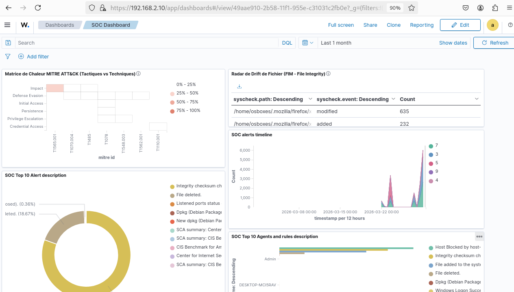
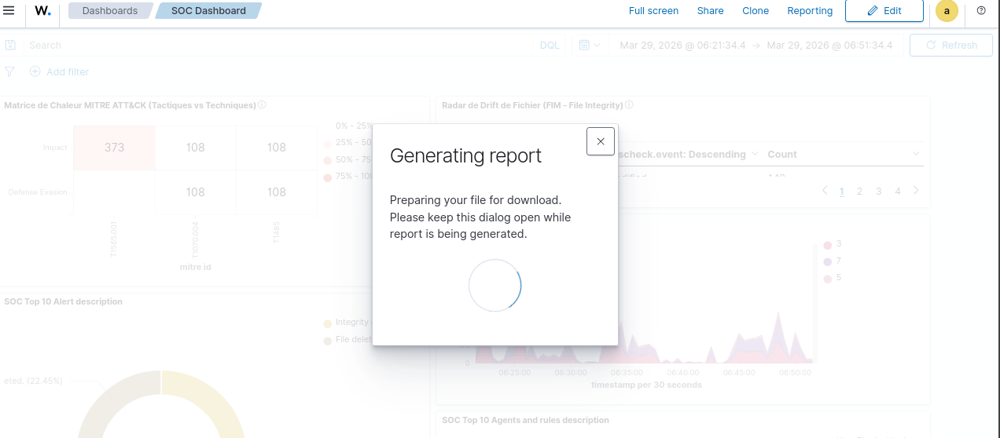
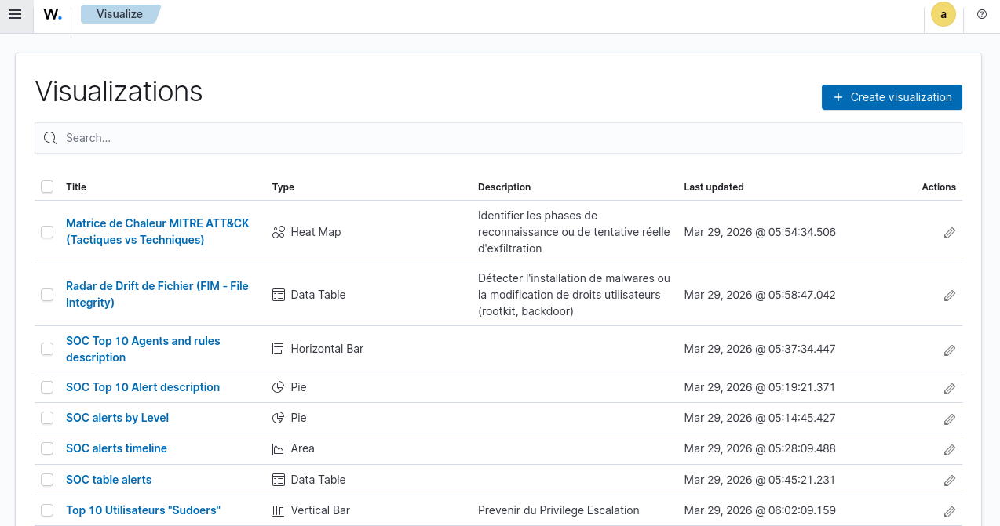

#  Wazuh SOC Dashboard - Configuration

Documentation complète de la configuration et de l'utilisation du Dashboard SOC professionnel pour la surveillance de l'environnement Lab.

---

##  Table des Matières

1. [Configuration du Serveur](#configuration-du-serveur)
2. [Visualisations du Dashboard](#visualisations-du-dashboard)
3. [Modules de Surveillance](#modules-de-surveillance)
4. [Sécurité et SSL/TLS](#sécurité-et-ssltls)
5. [Reporting et Exports](#reporting-et-exports)
6. [Bonnes Pratiques](#bonnes-pratiques)

---

##  Configuration du Serveur

### Paramètres de Base

```yaml
server.host: "0.0.0.0"
server.port: 443
server.basePath: "/app/wazuh"
server.name: "wazuh-dashboard"
```

**Explications :**
- **Host :** Adresse IP du serveur dashboard (accessible via `https://192.168.2.10:443`)
- **Port :** HTTPS sécurisé (port 443)
- **Base Path :** Chemin d'accès aux applications Wazuh (`/app/wazuh`)

### Connexion à OpenSearch

```yaml
opensearch.hosts: ["https://127.0.0.1:9200"]
opensearch.username: "kibanaserver"
opensearch.requestTimeout: 40000
opensearch.shardTimeout: 30000
opensearch.maxSockets: 1000
opensearch.maxRetries: 3
opensearch.compression: true
```

**Points clés :**
- Connexion sécurisée à OpenSearch via HTTPS
- Timeout de 40s pour les requêtes volumineuses
- Compression activée pour optimiser la bande passante
- Retry automatique (3 tentatives)

### Configuration Wazuh Spécifique

```yaml
pattern: wazuh-alerts-*
timeout: 20000

wazuh.enabled: true
wazuh.cacheSize: 500
wazuh.cacheTTL: 3600
wazuh.alerts.sample: 1000
wazuh.monitoring.enabled: true
wazuh.monitoring.frequency: 900
wazuh.monitoring.creation: d
```

| Paramètre | Valeur | Fonction |
|-----------|--------|----------|
| `pattern` | `wazuh-alerts-*` | Motif d'index pour les alertes |
| `timeout` | 20000ms | Délai max pour les requêtes |
| `cacheSize` | 500 | Nombre d'éléments en cache |
| `cacheTTL` | 3600s | TTL du cache (1h) |
| `monitoring.frequency` | 900s | Vérification chaque 15 min |

### Contrôles et Vérifications

```yaml
checks.pattern: true
checks.template: true
checks.api: true
checks.setup: true
checks.fields: true
checks.maxBuckets: 20000
```

Toutes les vérifications sont **activées** pour assurer la stabilité et la conformité du système.

---

##  Visualisations du Dashboard

###  Galerie Visual - Interface SOC Dashboard

####  Vue Principale du Dashboard
Le dashboard SOC offre une synthèse complète avec les éléments clés :



**Éléments visibles :**
-  **Matrice de Chaleur MITRE ATT&CK** : Heatmap montrant les techniques d'attaque détectées
-  **Radar FIM** : Modifications de fichiers système en temps réel
-  **Timeline des Alertes** : Graphique temporel coloré par niveau de gravité
-  **Top 10 Agents et Règles** : Barres horizontales pour identification rapide

---

####  Génération de Rapport
Le processus d'export PDF en action :



**Étapes affichées :**
1. Clic sur le bouton "Reporting" en haut-droit
2. Dialog "Generating report"
3. Message : "Preparing your file for download"
4. Spinner de progression
5. Téléchargement automatique du PDF

**Durée moyenne :** 30-60 secondes selon la complexité

---

####  Visualisations Disponibles
Liste complète des visualisations configurées :



**Visualisations SOC configurées :**

| Nom | Type | Fonction |
|-----|------|----------|
| **Matrice de Chaleur MITRE ATT&CK** | Heat Map | Identifier phases reconnaissance / exfiltration |
| **Radar de Drift FIM** | Data Table | Détecter malwares et modifications droits |
| **Top 10 Agents et Règles** | Horizontal Bar | Agents/règles les plus critiques |
| **Top 10 Alert Description** | Pie | Distribution des types d'alertes |
| **SOC alerts by Level** | Pie | Répartition par gravité (Critical, High, Medium) |
| **SOC alerts timeline** | Area Chart | Évolution temporelle colorée |
| **SOC table alerts** | Data Table | Liste brute pour deep-dive |
| **Top 10 Utilisateurs Sudoers** | Vertical Bar | Prévention Privilege Escalation |

---

### 1. SOC - Overview (Vue d'Ensemble)

**Objectif :** Synthèse immédiate de la santé sécurité du parc

| Visualisation | Type | Champ Clé | Filtre |
|---------------|------|-----------|--------|
| **Alertes par Niveau** | Donut Chart | `rule.level` | `rule.level >= 5` |
| **Timeline des Alertes** | Bar Chart | `@timestamp` | `rule.level >= 5` |
| **Top 10 Agents** | Horizontal Bar | `agent.name` | `rule.level >= 5` |
| **Top 10 Règles** | Horizontal Bar | `rule.description.keyword` | `rule.level >= 5` |

**Accès :** Tableau de bord principal au démarrage

---

### 2. SOC - Threat Detection (Détection des Menaces)

**Objectif :** Identifier l'origine et la nature des attaques externes

####  Global Threat Map (Temps Réel)
- **Type :** Coordinate Map / Maps
- **Données :** Géolocalisation (`GeoLocation.location`)
- **Info-bulles :** 
  - Adresse IP source (`data.srcip`)
  - Description de la règle (`rule.description`)
  - Tactic MITRE ATT&CK (`rule.mitre.tactic`)
- **Refresh :** 5 secondes pour suivi temps réel

####  Top IP Sources
- **Type :** Data Table
- **Filtre :** `NOT data.srcip: "192.168.*" AND data.srcip: *`
- **Exclusion :** Trafic interne (plages 192.168.x.x)

####  MITRE ATT&CK Matrix
- **Type :** Heatmap
- **Axes :** 
  - X : `rule.mitre.id` (ID des techniques)
  - Y : `rule.mitre.tactic` (Catégories d'attaque)
- **Usage :** Identifier les tactiques les plus fréquentes

---

### 3. SOC - Endpoint Security (Sécurité des Postes)

**Objectif :** Surveillance de l'intégrité et des privilèges locaux

####  Activité FIM (File Integrity Monitoring)
- **Table :** Modifications de fichiers
- **Colonnes clés :**
  - `syscheck.path` : Chemin du fichier modifié
  - `syscheck.event` : Type d'événement (création, suppression, modification)
- **Alerte :** Changements non autorisés sur fichiers critiques

####  Abus de Privilèges
- **Métrique :** Top des commandes `sudo` par utilisateur
- **Champ :** `data.srcuser`
- **Détection :** Activités d'escalade de privilèges suspectes

####  Gestion des Comptes
- **Surveillance :** Créations/suppressions d'utilisateurs
- **Règles associées :** `rule.id: 550 OR 551`
- **Impact :** Détection des modifications de comptes non autorisées

---

### 4. SOC - Advanced Detection (Détection Avancée)

**Objectif :** Détection proactive par IA et alerting automatisé

####  Anomaly Detection (Machine Learning)
- **Features monitorées :**
  - Volume d'alertes (`count`)
  - Diversité des IP sources (`cardinality`)
- **Seuil d'alerte :** `anomaly_grade > 0.7`
- **Action :** Notification automatique si anomalie détectée

####  Alerting & Triggers

**Canaux de notification :**
- Slack
- Email (via l'onglet *Destinations*)

**Moniteurs critiques configurés :**

| Moniteur | Condition | Action |
|----------|-----------|--------|
| **Brute Force Massive** | `count() > 50` en 5 min | Alerte immédiate |
| **Ransomware Activity** | `rule.groups: ransomware` | Blocage + Notification |
| **Privilège Elevation** | `rule.id: 550-600` | Escalade en P1 |

---

##  Sécurité et SSL/TLS

### Client → Dashboard (HTTPS)

```yaml
server.ssl.enabled: true
server.ssl.key: "/etc/wazuh-dashboard/certs/wazuh-dashboard-key.pem"
server.ssl.certificate: "/etc/wazuh-dashboard/certs/wazuh-dashboard.pem"
```

**Impact :** Chiffrement du trafic Client → Dashboard

### Dashboard → OpenSearch

```yaml
opensearch.ssl.verificationMode: "full"
opensearch.ssl.enabled: true
opensearch.ssl.key: "/etc/wazuh-dashboard/certs/wazuh-dashboard-key.pem"
opensearch.ssl.certificate: "/etc/wazuh-dashboard/certs/wazuh-dashboard.pem"
opensearch.ssl.certificateAuthorities: ["/etc/wazuh-dashboard/certs/root-ca.pem"]
opensearch.ssl.alwaysPresentCertificate: true
opensearch.ssl.rejectUnauthorized: true
```

**Sécurité maximum :** Authentification mutuelle (mTLS) avec vérification CA

### Authentification et Sessions

```yaml
opensearch.security.enabled: true
opensearch.security.multitenancy.enabled: false

opensearch.security.cookie.secure: true
opensearch.security.cookie.httpOnly: true
opensearch.security.cookie.sameSite: "Strict"
opensearch.security.session.ttl: 900000         
opensearch.security.session.keepalive: true
opensearch.security.session.keepaliveInterval: 300000
```

| Paramètre | Valeur | Protection |
|-----------|--------|-----------|
| `secure` | true | Cookie HTTPS seulement |
| `httpOnly` | true | Pas d'accès JavaScript |
| `sameSite` | Strict | Protection CSRF |
| `TTL` | 15 min | Session courte |

### Headers de Sécurité HTTP

```yaml
server.customResponseHeaders:
  "X-Content-Type-Options": "nosniff"
  "X-Frame-Options": "DENY"
  "X-XSS-Protection": "1; mode=block"
  "Strict-Transport-Security": "max-age=31536000; includeSubDomains"
  "Referrer-Policy": "strict-origin-when-cross-origin"
  "Permissions-Policy": "geolocation=(), microphone=(), camera=()"
```

**Protections activées :**
-  Anti-Clickjacking (X-Frame-Options: DENY)
-  Anti-XSS (X-XSS-Protection)
-  HSTS (Strict-Transport-Security 1 an)
-  CSP (Content-Security-Policy restrictive)
-  Permissions restrictives (géolocalisation, caméra bloquées)

### Audit Logging

```yaml
opensearch.audit.enabled: true
opensearch.audit.appender:
  type: "file"
  fileName: "/var/log/wazuh-dashboard/audit.log"

opensearch.audit.rotation:
  enabled: true
  max_file_size: "100MB"
  backup_count: 7
```

**Conformité :** 7 jours de logs d'audit, rotation automatique à 100MB

---

##  Reporting et Exports

### 1. Export Ponctuel (Instantané)

**Procédure :**
1. Ouvrir n'importe quel Dashboard
2. Cliquer sur le bouton **Reporting** (haut-droit)
3. Sélectionner **Generate PDF**
4. Télécharger le rapport

**Usage :** Rapport immédiat pour incident ou audit ad-hoc

### 2. Rapport Planifié (Automatique)

**Configuration :**
1. Menu : `Outils de gestion` > `Reporting` > `Create report definition`
2. Source : Choisir le Dashboard (ex: *SOC - Overview*)
3. Fréquence : Définir la planification (ex: Tous les lundis 08:00)
4. Diffusion : Envoi automatique par Email

**Avantages :**
- Rapports hebdomadaires/mensuels automatiques
- Distribution directrice sans intervention manuelle
- Archivage historique pour analyse de tendance

### 3. Structure Type d'un Rapport Professionnel

| Section | Visuel | Indicateur |
|---------|--------|-----------|
| **Synthèse** | Métrique (Nombre) | Volume total d'attaques bloquées |
| **Gravité** | Donut Chart | Distribution par `rule.level` |
| **Origine** | Geo Map / Table | Top IPs et pays attaquants |
| **Cibles** | Bar Chart | Top Agents les plus ciblés |
| **Conformité** | Table MITRE | Tactiques détectées |

**Formats supportés :**
-  PDF (pour distribution directrice)
-  CSV (pour analyse dans Excel)
-  Graphiques embarqués

---

## 🔧 Configuration Globale du Dashboard

### Paramètres Temporels

```yaml

Time Range: Last 24 Hours
Refresh Interval: 60 seconds          
Refresh Interval (Maps): 5 seconds    
```

### Contrôles et Filtres

**Éléments de contrôle disponibles :**
-  Filtre par `agent.name` (sélection multi-agents)
-  Filtre par `rule.level` (criticité minimale)
-  Filtre par plage temporelle (personnalisée)

**Utilisation :** Cliquer sur les contrôles en haut du Dashboard pour filtrer

### Optimisations de Performance

```yaml
logging.level: "info"
http.compression: true
http.compression.level: 6
http.keepaliveTimeout: 120000
http.maxHeaderSize: "8kb"
```

---

##  Bonnes Pratiques SOC

### 1. Filtrage des Alertes
```
 TOUJOURS appliquer le filtre rule.level >= 5
```
- Élimine les logs informatifs sans intérêt sécuritaire
- Réduit le bruit et les faux positifs
- Améliore la clarté des rapports

### 2. Archivage et Continuité
```
 Conserver les rapports mensuels
```
- Analyse de tendance (pics saisonniers, évolution)
- Détection d'anomalies long-terme
- Documentation de conformité

### 3. Exploitation des Visualisations

**Routine quotidienne :**
1.  **Matin :** Consulter *SOC - Overview* (alertes nuit)
2.  **Midi :** Vérifier *Threat Detection* (origines)
3.  **Après-midi :** Scanner *Endpoint Security* (compromissions)

### 4. Gestion des Incidents

**Procédure :**
1. Générer un rapport PDF instantané via *Reporting*
2. Exporter les données en CSV pour forensique
3. Créer une alerte/moniteur pour prévenir les récidives
4. Archiver le rapport dans les documents d'incident

### 5. Maintenance Régulière

| Tâche | Fréquence | Impact |
|-------|-----------|--------|
| Rotation des logs d'audit | Automatique (100MB) | Continuité des traces |
| Vérification de la connexion API | Hebdomadaire | Santé du système |
| Purge des anciens index | Mensuel | Optimisation stockage |
| Revue des règles de détection | Trimestriel | Adaptation menaces |

---

##  Support et Dépannage

### Accès au Dashboard

```
 https://192.168.2.10:443/app/wazuh
```

**Identifiants :** 
- Username : `wazuh`
- Mot de passe : Configuré dans la section `hosts`

### Connexion Wazuh Manager

```yaml
hosts:
  - default:
      url: https://192.168.2.10
      port: 55000
      username: wazuh
      password: 54($8481*?
      run_as: false
```

### Vérification de la Santé

1. **API Wazuh :** Menu `Tools` > `API Status`
2. **OpenSearch :** Logs → Onglet `Stack Monitoring`
3. **Agents :** Dashboard `SOC - Overview` → Section "Top 10 Agents"

---
