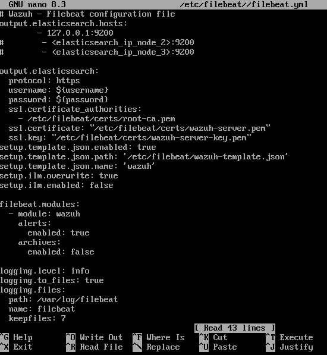
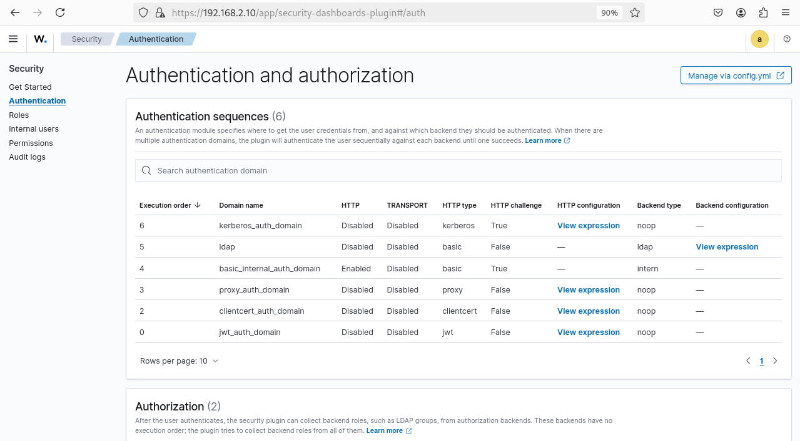
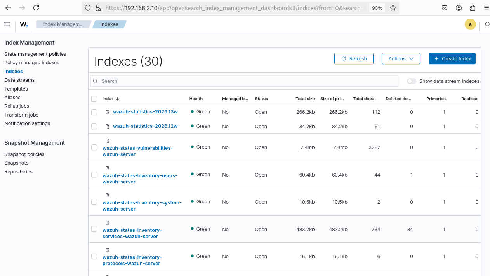
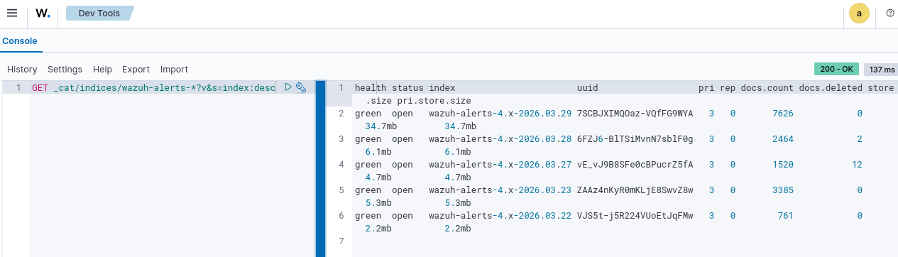
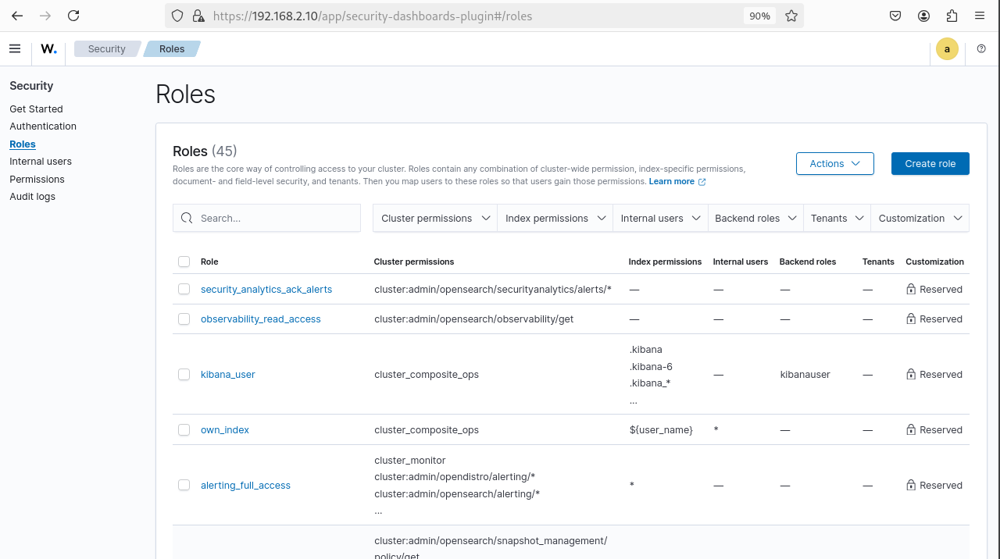
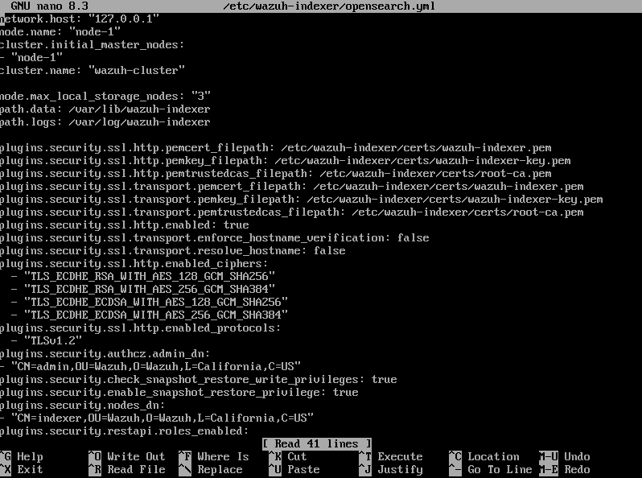

#  Wazuh Indexer - Configuration & Management 


##  Table des Matières

1. [Architecture et Composants](#architecture-et-composants)
2. [Configuration Filebeat](#configuration-filebeat)
3. [Authentification et Sécurité](#authentification-et-sécurité)
4. [Gestion des Indices](#gestion-des-indices)
5. [Dev Tools - Console OpenSearch](#dev-tools--console-opensearch)
6. [Gestion des Rôles et Permissions](#gestion-des-rôles-et-permissions)
7. [Configuration OpenSearch](#configuration-opensearch)
8. [Best Practices](#best-practices)

---

##  Architecture et Composants

### Flux de Données Complet

```
┌─────────────────┐
│ Wazuh Manager   │
│  (192.168.2.2)  │────┐
└─────────────────┘    │
                       │ JSON Alerts
                       │ Port 514/TLS
                       ▼
┌─────────────────────────────────┐
│ Filebeat                        │
│ (Data Shipper)                  │
└────────────────┬────────────────┘
                 │
         HTTPS Port 9200
         avec certificats SSL
                 │
                 ▼
    ┌────────────────────────────┐
    │ Wazuh Indexer/OpenSearch   │
    │  (192.168.2.10:9200)       │
    │                            │
    │ ├─ Node 1: indexer-1       │
    │ └─ Cluster: wazuh-cluster  │
    └────────────────┬───────────┘
                     │
            Dashboard Query
                     │
                     ▼
        ┌──────────────────────┐
        │ Wazuh Dashboard      │
        │ (192.168.1.50:443)   │
        └──────────────────────┘
```

---

##  Configuration Filebeat

### Vue d'ensemble

Filebeat est le **collecteur et expéditeur de données** qui:
-  Lit les alertes JSON du Wazuh Manager
-  Les envoie au Wazuh Indexer via HTTPS
-  Gère la compression et la mise en buffer
-  Authentifie avec les certificats SSL

### Configuration Actuelle



**Fichier:** `/etc/filebeat/filebeat.yml`

#### Détail des Paramètres

| Paramètre | Valeur | Fonction |
|-----------|--------|----------|
| **output.elasticsearch.hosts** | 127.0.0.1:9200 | Adresse de destination |
|                                | elasticsearch_ip_node_2:9200 | Nœud 2 (redondance) |
|                                | elasticsearch_ip_node_3:9200 | Nœud 3 (redondance) |
| **output.elasticsearch.protocol** | https | Chiffrement TLS |
| **username** | ${username} | Variable d'environnement |
| **password** | ${password} | Variable d'environnement |
| **ssl.certificate_authorities** | /etc/filebeat/certs/root-ca.pem | Certificat CA |
| **ssl.certificate** | /etc/filebeat/certs/wazuh-server.pem | Certificat client |
| **ssl.key** | /etc/filebeat/certs/wazuh-server-key.pem | Clé privée |
| **setup.template.json.path** | /etc/filebeat/wazuh-template.json | Template mapping |
| **setup.template.json.name** | wazuh | Nom du template |
| **setup.ilm.overwrite** | true | Forcer remplacement ILM |
| **setup.ilm.enabled** | false | Désactiver ILM local |

### Modules Wazuh

```yaml
filebeat.modules:
  - module: wazuh
    alerts:
      enabled: true        # Recevoir les alertes
    archives:
      enabled: false       # Alertes + archives = bruit
```

 **Note:** Ne pas activer archives + alerts ensemble (doublons)

### Logging

```yaml
logging.level: info                    # info/debug/warning
logging.to_files: true
logging.files:
  path: /var/log/filebeat
  name: filebeat
  keepfiles: 7                         # Rotation 7 jours
```

### Vérification de la Connexion

```bash
# Tester la connexion
curl -k -u ${username}:${password} \
  https://127.0.0.1:9200/_cluster/health

# Vérifier les logs
tail -f /var/log/filebeat/filebeat.log | grep -i "elasticsearch"

# Status du service
systemctl status filebeat
```

---

##  Authentification et Sécurité

### Sécurité OpenSearch - Séquences d'Authentification



### Architecture d'Authentification

Le système utilise **6 domaines d'authentification en cascade**:

#### 1. **Kerberos** (Ordre 6)
```
Enabled:  Disabled
HTTP: Disabled | Transport: Disabled
Backend: noop (pas d'effet)
Challenge HTTP:  True
```
- **Usage:** Environnements Active Directory/Kerberos
- **Status:** Inactif dans votre Lab

#### 2. **LDAP** (Ordre 5)
```
Enabled:  Disabled
HTTP: Disabled | Transport: Disabled
Backend: ldap
```
- **Usage:** Synchronisation comptes d'entreprise
- **Status:** Non configuré

#### 3. **Basic Internal** (Ordre 4 -  PRINCIPAL)
```
Enabled:  Enabled
HTTP: Enabled | Transport: Disabled
Backend: internal
HTTP Challenge:  True
```
- **Usage:** Authentification locale (admin/kibanaserver)
- **Configuration:** Base de données interne OpenSearch
- **Status:** **ACTIF et utilisé**

#### 4. **Proxy** (Ordre 3)
```
Enabled:  Disabled
HTTP: Disabled | Transport: Disabled
Backend: noop
Challenge:  False
```
- **Usage:** SSO via reverse proxy
- **Status:** Inactif

#### 5. **Client Certificate** (Ordre 2)
```
Enabled:  Disabled
HTTP: Disabled | Transport: Disabled
Backend: noop
```
- **Usage:** Authentification par certificat client
- **Status:** Non utilisé

#### 6. **JWT** (Ordre 0)
```
Enabled:  Disabled
HTTP: Disabled | Transport: Disabled
Backend: noop
Challenge:  False
```
- **Usage:** Tokens JWT pour API externes
- **Status:** Désactivé

### Flux d'Authentification Réel

```
┌─────────────────┐
│ Utilisateur     │
│ admin / password│
└────────┬────────┘
         │
         │ Basic Auth (Base64)
         │
         ▼
┌────────────────────────────┐
│ OpenSearch Security Plugin │
│                            │
│ Domaine 1: Basic_Internal  │
│ ├─ HTTP: ENABLED           │
│ ├─ Base interne: ACTIVE    │
│ └─ Match → Authentifié     │
└────────────────────────────┘
```

### Utilisateurs Internes

```bash
# Lister les utilisateurs
curl -k -u admin:YOUR_PASSWORD \
  'https://192.168.2.10:9200/_plugins/_security/api/internalusers'

# Structure retournée:
{
  "admin": {
    "hash": "bcrypt_hash...",
    "reserved": true,
    "hidden": false
  },
  "kibanaserver": {
    "hash": "bcrypt_hash...",
    "reserved": true,
    "hidden": false
  }
}
```

### Certificats SSL Requis

| Certificat | Chemin | Usage |
|------------|--------|-------|
| **root-ca.pem** | `/etc/filebeat/certs/` | CA pour valider les certs serveur |
| **wazuh-server.pem** | `/etc/filebeat/certs/` | Certificat client (mTLS) |
| **wazuh-server-key.pem** | `/etc/filebeat/certs/` | Clé privée client |

---

##  Gestion des Indices

### Interface d'Administration des Indices



**Navigation:** `☰ > Indexer management > Indices`

### Informations Affichées

La page montre **30 indices** actifs:

#### Exemple: `wazuh-statistics-2026.13w`

```
Health:               Green (Sain)
Managed by:          No (Pas de politique ILM)
Status:              Open (Accessible)
Total size:          266.2 kb
Size primary shards: 266.2 kb
Total documents:     112
Deleted documents:   0
Primaries:           1
Replicas:            0
```

#### Exemple: `wazuh-states-vulnerabilities-wazuh-server`

```
Health:               Green
Total size:          2.4 mb
Documents:           3787
Primaries:           1 shard
Replicas:            0
```

### Actions Possibles

| Action | Description | Impact |
|--------|-------------|--------|
| **Refresh** | Recharger la liste | Aucun |
| **Actions** | Menu déroulant | Voir ci-dessous |
| **Create Index** | Créer manuellement | Avancé |

### Menu Actions

```
└─ Actions
   ├─ Edit index settings
   ├─ Clone index
   ├─ Split index
   ├─ Shrink index
   ├─ Force merge
   ├─ Clear cache
   ├─ Flush
   ├─ Close index
   ├─ Delete index
   └─ Reindex
```

### Exemples Courants

#### Force Merge (Optimisation)

```bash
# Réduire le nombre de segments
curl -XPOST -k -u admin:YOUR_PASSWORD \
  'https://192.168.2.10:9200/wazuh-alerts-4.x-*/_forcemerge?max_num_segments=1'
```

**Effet:** ↓ 20-30% taille disque, ↑ latence lecture

#### Cloner un Index

```bash
# Copier un index pour archive
curl -XPOST -k -u admin:YOUR_PASSWORD \
  'https://192.168.2.10:9200/wazuh-alerts-4.x-2026.03.29/_clone/archive-2026-03-29'
```

---

##  Dev Tools - Console OpenSearch

### Console de Requêtes



**Navigation:** `☰ > Indexer management > Dev Tools`

### Requête Affichée

```opensearch
GET _cat/indices/wazuh-alerts-*?v&s=index:desc
```

**Résultat:**
```
health status index                       uuid    pri rep docs.count docs.deleted store.size pri.store.size
green  open   wazuh-alerts-4.x-2026.03.29 7SCB... 3   0   7626       0            34.7mb     34.7mb
green  open   wazuh-alerts-4.x-2026.03.28 6FZJ... 3   0   2464       2            6.1mb      6.1mb
green  open   wazuh-alerts-4.x-2026.03.27 vE_v... 3   0   1520       12           4.7mb      4.7mb
green  open   wazuh-alerts-4.x-2026.03.23 ZAAz... 3   0   3385       0            5.3mb      5.3mb
green  open   wazuh-alerts-4.x-2026.03.22 vJS5... 3   0   761        0            2.2mb      2.2mb
```

### Requêtes Essentielles

#### 1. Voir tous les indices

```opensearch
GET _cat/indices?v
```

#### 2. Santé du cluster

```opensearch
GET _cluster/health?pretty
```

#### 3. Statistiques du cluster

```opensearch
GET _cluster/stats?pretty
```

#### 4. Documents par index

```opensearch
GET _cat/indices/wazuh-alerts-*?v&s=docs.count:desc
```

#### 5. Utilisation disque

```opensearch
GET _cat/allocation?v
```

#### 6. Nombre de shards

```opensearch
GET _cat/shards/wazuh-alerts-*?v
```

#### 7. Récupérer un document

```opensearch
GET wazuh-alerts-4.x-2026.03.29/_doc/MTpH4HgBXZL0RfBcJ4BV
```

#### 8. Recherche simple

```opensearch
GET wazuh-alerts-4.x-2026.03.29/_search
{
  "query": {
    "match": {
      "rule.level": 7
    }
  },
  "size": 10
}
```

### Interface Interactive

La console offre:
-  **Auto-completion** (Ctrl+Space)
-  **Historique** des requêtes
-  **Export/Import** JSON
-  **Exécution** instantanée (Ctrl+Enter)
-  **Temps de réponse** affiché (137ms)
-  **Résultats** formatés automatiquement

---

##  Gestion des Rôles et Permissions

### Rôles OpenSearch



**Navigation:** `☰ > Security > Roles`  

### Vue d'ensemble des Rôles (45 rôles)

Le système contient **45 rôles prédéfinis**:

#### Rôles Principaux

| Rôle | Permissions Cluster | Permissions Index | Utilisateurs Internes | Status |
|------|-------------------|-------------------|----------------------|--------|
| **security_analytics_ack_alerts** | cluster:admin/opensearch/securityanalytics/alerts/* | — | — | Reserved |
| **observability_read_access** | cluster:admin/opensearch/observability/get | — | — | Reserved |
| **kibana_user** | cluster_composite_ops | .kibana, .kibana-6, .kibana-* | kibanauser | Reserved |
| **own_index** | cluster_composite_ops | ${user.name} * | — | Reserved |
| **alerting_full_access** | cluster:monitor, cluster:admin/opendistro/alerting/*, cluster:admin/opensearch/alerting/* | * | — | Reserved |

#### Exemple: Rôle `kibana_user`

```json
{
  "cluster_permissions": ["cluster_composite_ops"],
  "index_permissions": [
    {
      "index_patterns": [".kibana", ".kibana-6", ".kibana-*"],
      "allowed_actions": ["indices_all"]
    }
  ],
  "tenant_permissions": [],
  "static": true
}
```

### Création d'un Rôle Personnalisé

**Bouton:** `Create role` (bleu)

```bash
# Exemple: Rôle pour analystes SOC
curl -XPOST -k -u admin:YOUR_PASSWORD \
  'https://192.168.2.10:9200/_plugins/_security/api/roles/soc_analyst' \
  -H 'Content-Type: application/json' \
  -d '{
    "cluster_permissions": ["cluster_monitor"],
    "index_permissions": [
      {
        "index_patterns": ["wazuh-alerts-*"],
        "allowed_actions": [
          "read",
          "indices:data/read/search"
        ]
      }
    ],
    "tenant_permissions": []
  }'
```

### Mapping Utilisateur → Rôle

```bash
# Assigner un rôle à un utilisateur
curl -XPUT -k -u admin:YOUR_PASSWORD \
  'https://192.168.2.10:9200/_plugins/_security/api/rolesmapping/soc_analyst' \
  -H 'Content-Type: application/json' \
  -d '{
    "users": ["analyst1", "analyst2"],
    "roles": [],
    "backend_roles": []
  }'
```

### Filtres de Rôles

Disponibles:
-  **Cluster permissions** - Actions globales
-  **Index permissions** - Accès par index
-  **Internal users** - Utilisateurs assignés
-  **Backend roles** - Rôles LDAP/Kerberos
-  **Tenants** - Isolement multi-tenant
-  **Customization** - Rôles personnalisés

---

##  Configuration OpenSearch

### Fichier de Configuration Principal



**Fichier:** `/etc/wazuh-indexer/opensearch.yml`

### Paramètres Affichés

```yaml

network.host: "127.0.0.1"           # Adresse d'écoute
cluster.initial_master_nodes:
  - "node-1"                         # Nœud maître initial
cluster.name: "wazuh-cluster"        # Nom du cluster


node.max_local_storage_nodes: "3"   # Max nœuds par machine
path.data: /var/lib/wazuh-indexer   # Répertoire données
path.logs: /var/log/wazuh-indexer   # Répertoire logs

plugins.security.ssl.http.pemcert_filepath: /etc/wazuh-indexer/certs/wazuh-indexer.pem
plugins.security.ssl.http.pemkey_filepath: /etc/wazuh-indexer/certs/wazuh-indexer-key.pem
plugins.security.ssl.http.pemtrustedcas_filepath: /etc/wazuh-indexer/certs/root-ca.pem

plugins.security.ssl.transport.pemcert_filepath: /etc/wazuh-indexer/certs/wazuh-indexer.pem
plugins.security.ssl.transport.pemkey_filepath: /etc/wazuh-indexer/certs/wazuh-indexer-key.pem
plugins.security.ssl.transport.pemtrustedcas_filepath: /etc/wazuh-indexer/certs/root-ca.pem
plugins.security.ssl.transport.enforce_hostname_verification: false
plugins.security.ssl.transport.resolve_hostname: false


plugins.security.ssl.http.enabled_ciphers:
  - "TLS_ECDHE_RSA_WITH_AES_128_GCM_SHA256"
  - "TLS_ECDHE_RSA_WITH_AES_256_GCM_SHA384"
  - "TLS_ECDHE_ECDSA_WITH_AES_128_GCM_SHA256"
  - "TLS_ECDHE_ECDSA_WITH_AES_256_GCM_SHA384"
plugins.security.ssl.http.enabled_protocols:
  - "TLSv1.2"


plugins.security.authcz.admin_dn:
  - "CN=admin,OU=Wazuh,O=Wazuh,L=California,C=US"

plugins.security.check_snapshot_restore_write_privileges: true
plugins.security.enable_snapshot_restore_privilege: true
nodes.dn:
  - "CN=indexer,OU=Wazuh,O=Wazuh,L=California,C=US"

plugins.security.restapi.roles_enabled: ["all_access"]
```

### Configuration Critique

#### 1. **network.host**
```yaml
network.host: "127.0.0.1"  # Localhost uniquement!
                           # À remplacer par IP réelle en prod
```

 **Important:** Doit être l'IP réelle du serveur, pas localhost

#### 2. **Certificats SSL**
```yaml
plugins.security.ssl.http.pemcert_filepath: /etc/wazuh-indexer/certs/wazuh-indexer.pem
plugins.security.ssl.http.pemkey_filepath: /etc/wazuh-indexer/certs/wazuh-indexer-key.pem
```

Les 3 certificats requis:
-  Certificat HTTP (client → indexer)
-  Certificat Transport (inter-nœuds)
-  CA Root (validation)

#### 3. **Admin DN**
```yaml
plugins.security.authcz.admin_dn:
  - "CN=admin,OU=Wazuh,O=Wazuh,L=California,C=US"
```

Distinguished Name du certificat admin

### Vérification Après Modification

```bash
# 1. Valider la syntaxe
/usr/share/wazuh-indexer/bin/opensearch-keystore list

# 2. Redémarrer le service
systemctl restart wazuh-indexer

# 3. Vérifier l'état
systemctl status wazuh-indexer

# 4. Vérifier les logs
tail -n 50 /var/log/wazuh-indexer/wazuh-indexer.log | grep -i "error\|exception"

# 5. Tester la connexion
curl -k -u admin:YOUR_PASSWORD https://127.0.0.1:9200/_cluster/health
```

---

##  Best Practices

### 1. Sécurité

#### Certificats
-  Renouveler **avant expiration** (alerte 30j avant)
-  Utiliser **RSA 2048** minimum ou **ECDP-256**
-  Stocker clés privées avec permissions **600**

```bash
# Vérifier expiration
openssl x509 -in /etc/wazuh-indexer/certs/wazuh-indexer.pem -dates -noout
```

#### Mots de passe
-  Minimum **12 caractères**
-  Inclure **majuscules, minuscules, chiffres, symboles**
-  Changer tous les **90 jours**
-  Différent pour **chaque utilisateur**

```bash
# Changer mot de passe d'un utilisateur
curl -XPUT -k -u admin:OLD_PASSWORD \
  'https://192.168.2.10:9200/_plugins/_security/api/internalusers/kibanaserver' \
  -H 'Content-Type: application/json' \
  -d '{
    "password": "NEW_SECURE_PASSWORD",
    "reserved": true
  }'
```

### 2. Performance

#### Sizing Mémoire

```
Données quotidiennes = 50 GB
├─ HOT (7 jours) = 350 GB RAM recommandée 32-64 GB
├─ WARM (30j) = Compressé 80%
└─ COLD (365j) = Archivé/Supprimé
```

#### Shards par Index

**Règle:** 1 shard par GB de données par jour

```
Exemple:
- 50 GB/jour → 50 shards ?  TROP
- 50 GB/jour → 5 shards  BON
- Formule: GB_par_jour / 10 = nombre_shards
```

### 3. Monitoring Quotidien

#### Checklist

- [ ] **Cluster Health** = GREEN
- [ ] **CPU** < 80%
- [ ] **Mémoire Heap** < 85%
- [ ] **Espace Disque** > 20% libre
- [ ] **Nombre docs** en croissance
- [ ] **Latence requête** < 1s
- [ ] **Pas d'alertes** non-assignées

#### Commandes

```bash
# Santé complète
curl -k -u admin:YOUR_PASSWORD \
  'https://192.168.2.10:9200/_cluster/health?pretty'

# Mémoire JVM
curl -k -u admin:YOUR_PASSWORD \
  'https://192.168.2.10:9200/_nodes/stats/jvm?pretty' | grep -A 5 '"mem"'

# Espace disque
curl -k -u admin:YOUR_PASSWORD \
  'https://192.168.2.10:9200/_cat/allocation?v'

# Nombre de documents
curl -k -u admin:YOUR_PASSWORD \
  'https://192.168.2.10:9200/_cat/indices?v' | awk '{total+=$7} END {print "Total docs:", total}'
```

### 4. Maintenance

#### Archivage Hebdomadaire

```bash
#!/bin/bash
DATE=$(date -d "last friday" +%Y.%m.%d)
INDEX="wazuh-alerts-4.x-$DATE"

# 1. Créer snapshot
curl -XPUT -k -u admin:YOUR_PASSWORD \
  "https://192.168.2.10:9200/_snapshot/backup/snap-$DATE" \
  -d "$(curl -s https://192.168.2.10:9200/$INDEX?pretty)"

# 2. Attendre (10 min)
sleep 600

# 3. Supprimer l'index
curl -XDELETE -k -u admin:YOUR_PASSWORD \
  "https://192.168.2.10:9200/$INDEX"

echo "Snapshot et suppression de $INDEX terminés"
```

#### Purge Mensuelle

```bash
# Supprimer indices > 365 jours
curl -XDELETE -k -u admin:YOUR_PASSWORD \
  'https://192.168.2.10:9200/wazuh-alerts-4.x-2025*'

# Compresser les archives
curl -XPOST -k -u admin:YOUR_PASSWORD \
  'https://192.168.2.10:9200/wazuh-archives-*/_forcemerge?max_num_segments=1'
```

### 5. Disaster Recovery

#### Plan de Récupération (RTO/RPO)

| Niveau | RTO | RPO | Méthode |
|--------|-----|-----|---------|
| Quoatidien | 4h | 1j | Snapshot S3 |
| Mensuel | 24h | 1m | Backup complet |
| Annuel | 72h | 1a | Archive freeze |

#### Procédure de Restauration

```bash
# 1. Vérifier les snapshots disponibles
curl -k -u admin:YOUR_PASSWORD \
  'https://192.168.2.10:9200/_snapshot/backup/_all'

# 2. Fermer les indices
curl -XPOST -k -u admin:YOUR_PASSWORD \
  'https://192.168.2.10:9200/wazuh-alerts-*/_close'

# 3. Restaurer depuis snapshot
curl -XPOST -k -u admin:YOUR_PASSWORD \
  'https://192.168.2.10:9200/_snapshot/backup/snap-2026-03-15/_restore' \
  -H 'Content-Type: application/json' \
  -d '{
    "indices": "wazuh-alerts-4.x-*",
    "ignore_unavailable": true,
    "include_global_state": false
  }'

# 4. Attendre la restauration
curl -k -u admin:YOUR_PASSWORD \
  'https://192.168.2.10:9200/_cluster/health?wait_for_status=green&timeout=10m'

# 5. Rouvrir les indices
curl -XPOST -k -u admin:YOUR_PASSWORD \
  'https://192.168.2.10:9200/wazuh-alerts-*/_open'
```

---

##  Support et Ressources

### Documentation

-  **Wazuh Indexer:** https://documentation.wazuh.com/current/user-manual/wazuh-indexer/
-  **OpenSearch:** https://opensearch.org/docs/latest/
-  **Security Plugin:** https://opensearch.org/docs/latest/security-plugin/

### Commandes Rapides

```bash
# Installer des dépendances
sudo yum install curl vim nano

# Éditer configuration
sudo nano /etc/wazuh-indexer/opensearch.yml

# Redémarrer services
sudo systemctl restart wazuh-indexer
sudo systemctl restart filebeat
sudo systemctl restart wazuh-dashboard

# Logs en temps réel
sudo tail -f /var/log/wazuh-indexer/wazuh-indexer.log

# Status global
systemctl status wazuh-indexer filebeat wazuh-manager wazuh-dashboard
```

### Dépannage Courant

| Problème | Solution |
|----------|----------|
| **Connection refused** | Vérifier IP/Port, pare-feu |
| **SSL certificate verify failed** | Certificat expiré ou invalide |
| **Cluster RED** | Vérifier espace disque, logs |
| **Indices non créés** | Vérifier Filebeat, permissions Elasticsearsh |
| **Requête lente** | Réduire time range, ajouter shards |

---

