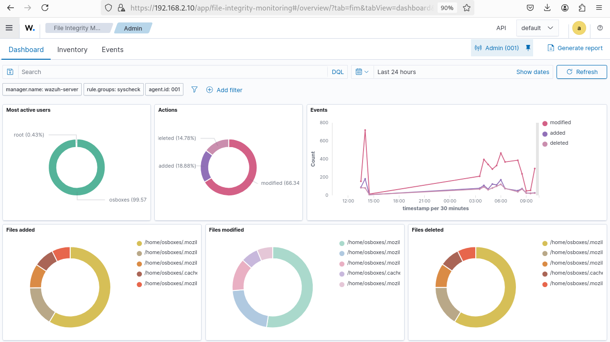
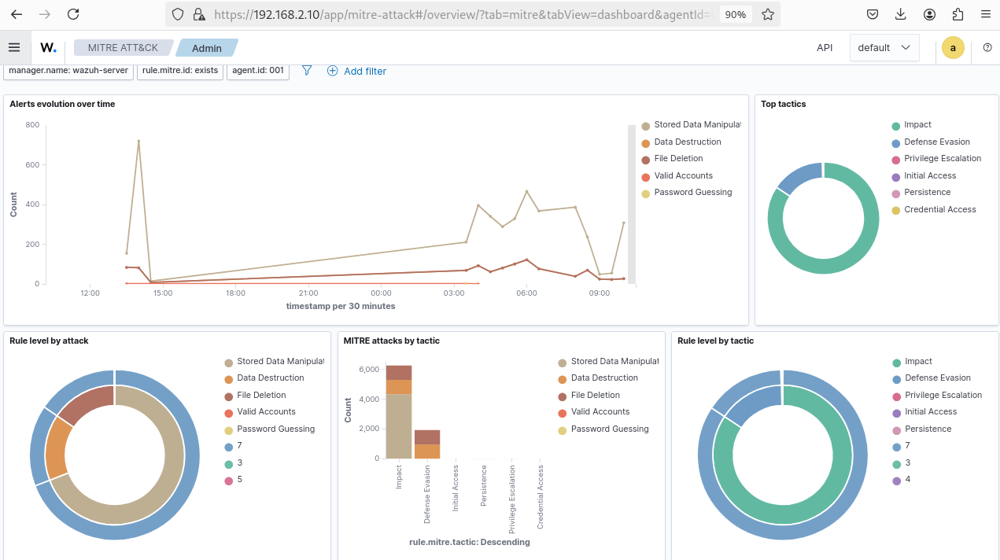
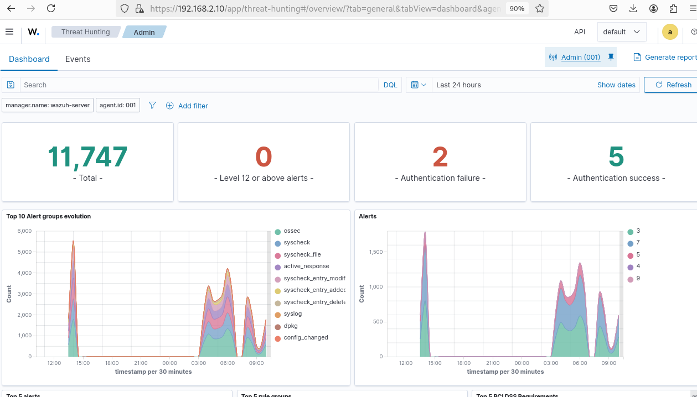
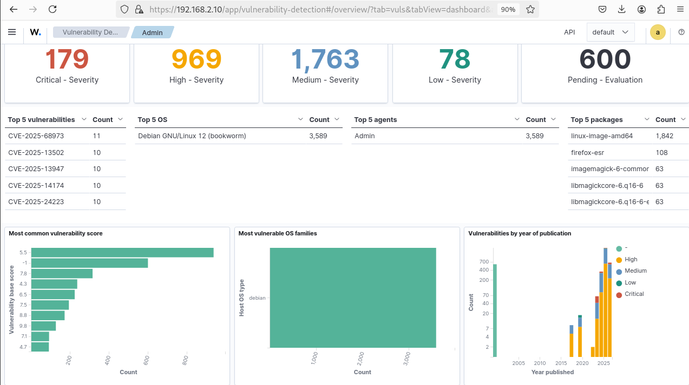

# Wazuh Threat Intelligence - Configuration & Monitoring

## Table des Matières
- [Introduction](#introduction)
- [Architecture Overview](#architecture-overview)
- [Composants Principaux](#composants-principaux)
- [File Integrity Monitoring](#file-integrity-monitoring)
- [MITRE ATT&CK Framework](#mitre-attck-framework)
- [Threat Hunting](#threat-hunting)
- [Vulnerability Detection](#vulnerability-detection)
- [Best Practices](#best-practices)
- [Ressources](#ressources)

---

## Introduction

Wazuh Threat Intelligence est une plateforme complète de détection des menaces, de gestion des vulnérabilités et de hunting des menaces. Cette configuration fournit une visibilité holistique sur votre infrastructure de sécurité avec intégration du framework MITRE ATT&CK.

**Composants clés:**
- File Integrity Monitoring (FIM)
- MITRE ATT&CK Mapping
- Threat Hunting avancé
- Vulnerability Detection & Management

---

## Architecture Overview

Wazuh Threat Intelligence fonctionne sur une architecture centralisée composée de:

- **Manager Wazuh**: Contrôleur central (`wazuh-server`)
- **Agents distribués**: Collecte de données sur les endpoints
- **Dashboard**: Interface d'analyse et de visualisation
- **API**: Intégration avec systèmes externes

**Configuration de base:**
```
Manager: wazuh-server
Role Groups: syscheck, exists
Agent ID: 001
API: Disponible via https://192.168.2.10
```

---

## Composants Principaux

### 1. File Integrity Monitoring (FIM)



#### Vue d'ensemble
Le module File Integrity Monitoring permet de monitorer les changements de fichiers critiques en temps réel.

**Statistiques de monitoring:**
- **Utilisateur le plus actif**: `root` (0.43% des actions)
- **Serveur OSX**: `osboxes` (99.57% des événements)
- **Actions détectées**:
  - Modified: 66.34%
  - Added: 18.88%
  - Deleted: 14.78%

#### Fichiers monitorés par catégorie

**Fichiers ajoutés (Added)**
- `/home/osboxes/mozilla/` (multiples entrées)
- `/home/osboxes/cache/`

**Fichiers modifiés (Modified)**
- `/home/osboxes/mozilla/` (principal)
- `/home/osboxes/cache/`

**Fichiers supprimés (Deleted)**
- `/home/osboxes/mozilla/` (principal)
- `/home/osboxes/cache/`

#### Tendances temporelles
Le graphique "Events" montre:
- Pic majeur autour de 15:00 (~800 événements)
- Événements "modified" dominants
- Stabilisation progressive après 18:00

#### Configuration 
```xml
<syscheck>
  <frequency>300</frequency>
  <directories>/home/osboxes/mozilla</directories>
  <directories>/home/osboxes/cache</directories>
  <directories>/critical/path</directories>
  <monitored-files>Important system files</monitored-files>
  <skip_nfs>yes</skip_nfs>
  <skip_dev>yes</skip_dev>
</syscheck>
```

---

## MITRE ATT&CK Framework



### Analyse des attaques mappées

Le framework MITRE ATT&CK permet de classifier et d'analyser les tactiques et techniques d'attaque détectées.

#### Évolution des alertes dans le temps

**Statistiques globales:**
- Pic maximum: ~750 alertes (15:00)
- Stabilisation après 21:00
- Deuxième pic notable: ~400 alertes (09:00)

#### Tactiques détectées (Top Tactics)

| Tactique | Description | Statut |
|----------|-------------|--------|
| **Impact** | Techniques visant à impacter la disponibilité/confidentialité | Majeure |
| **Defense Evasion** | Contournement des mécanismes de défense | Élevée |
| **Privilege Escalation** | Escalade de privilèges | Modérée |
| **Initial Access** | Points d'entrée initiaux | Présente |
| **Persistence** | Maintien de la présence | Présente |
| **Credential Access** | Accès aux identifiants | Présente |

#### Analyse par attaque

**Attaques principales mappées:**
1. **Stored Data Manipulation** - Manipulation de données stockées
2. **Data Destruction** - Destruction de données
3. **File Deletion** - Suppression de fichiers
4. **Valid Accounts** - Utilisation de comptes légitimes
5. **Password Guessing** - Devinage de mots de passe

#### Niveau de sévérité des règles (Rule level by attack)
```
Level 7: Stored Data Manipulation
Level 5: Data Destruction
Level 3: File Deletion
Level 3: Valid Accounts
Level 7: Password Guessing
```

#### MITRE Tactics by Attack Count
- **Stored Data Manipulation**: ~6,000 occurrences
- **Data Destruction**: ~1,500 occurrences
- **File Deletion**: Présente mais moins fréquente
- **Valid Accounts**: Faible activité
- **Password Guessing**: Minimale

#### Recommandations de réponse
```
1. Alert Level 7+ : Investigation immédiate requise
2. Alert Level 5-6 : Analyse dans les 2 heures
3. Alert Level 3-4 : Revue quotidienne recommandée
4. Alertes répétées : Implémenter des règles de corrélation
```

---

## Threat Hunting



### Vue d'ensemble du hunting

Le module Threat Hunting fournit les capacités de recherche avancée pour identifier les menaces potentielles.

#### Métriques principales

| Métrique | Valeur | Interprétation |
|----------|--------|----------------|
| **Total Alerts** | 11,747 | Volume global d'alertes |
| **Level 12+ Alerts** | 0 | Aucune alerte critique extrême |
| **Authentication Failures** | 2 | Tentatives échouées minimales |
| **Authentication Success** | 5 | Authentifications réussies |

#### Analyse des groupes d'alertes

**Top 10 Alert Groups Evolution:**

Les groupes d'alerte dominants sur la période:
- **ossec** - Alertes système principal
- **syscheck** - Intégrité des fichiers
- **syscheck_file** - Modifications de fichiers
- **active_response** - Réponses actives
- **syscheck_entry_modif** - Modifications d'entrées
- **syscheck_entry_added** - Entrées ajoutées
- **syscheck_entry_delete** - Entrées supprimées
- **syslog** - Logs système
- **dpkg** - Gestionnaire de paquets
- **config_changed** - Changements de configuration

**Tendance temporelle:**
- Pic majeur vers 15:00 (~5,500 événements)
- Deuxième pic vers 09:00 (~4,000 événements)
- Stabilisation générale vers minuit

#### Alertes par priorité

Distribution des alertes:
- **Niveau 3 (Low)**: Dominant
- **Niveau 7 (Medium-High)**: Présent
- **Niveau 5 (Medium)**: Secondaire
- **Niveau 4 (Medium-Low)**: Minimal
- **Niveau 9 (High)**: Très faible

#### Indicateurs de compromission (IOCs)

**Paramètres de recherche configurés:**
- Manager: `wazuh-server`
- Agent ID: `001`
- Période: Dernières 24 heures
- Filtre DOL (Date-Order-Limit) activé

#### Stratégies de hunting recommandées

1. **Analyse des authentifications**
   - Monitorer les patterns de connexion
   - Détecter les brute-force attempts
   - Identifier les accès anormaux

2. **Suivi de l'intégrité des fichiers**
   - Alertes sur modifications non autorisées
   - Changements de permissions
   - Suppressions suspects

3. **Corrélation des événements**
   - Identifier les séquences d'attaque
   - Détecter les chaînes multi-étapes
   - Analyser les patterns temporels

4. **Détection d'anomalies**
   - Utiliser les seuils dynamiques
   - Comparer avec la baseline
   - Identifier les comportements anormaux

---

## Vulnerability Detection



### Gestion des vulnérabilités

Le module Vulnerability Detection fournit une visibilité complète sur l'état des vulnérabilités de l'infrastructure.

#### Résumé de sévérité

| Sévérité | Count | Status |
|----------|-------|--------|
| **Critical** | 179 |  Action immédiate requise |
| **High** | 969 |  Planifier un patch |
| **Medium** | 1,763 |  Monitorer |
| **Low** | 78 |  Faible priorité |
| **Pending Evaluation** | 600 |  En attente d'évaluation |

**Total vulnérabilités détectées: 3,589**

#### Top 5 Vulnérabilités critiques

| CVE ID | Count | Severity |
|--------|-------|----------|
| CVE-2025-68973 | 11 | Critical |
| CVE-2025-13502 | 10 | Critical |
| CVE-2025-13947 | 10 | Critical |
| CVE-2025-14174 | 10 | Critical |
| CVE-2025-24223 | 10 | Critical |

#### Système d'exploitation affecté

**Top OS - Debian GNU/Linux 12 (bookworm)**
- **Instances affectées**: 3,589
- **Vulnérabilités liées**: Critique & Haute
- **Priorité de patch**: Immédiate

#### Top 5 Packages vulnérables

| Package | Count | Criticality |
|---------|-------|-------------|
| linux-image-amd64 | 1,842 | Critical |
| firefox-esr | 108 | High |
| imagemagick-6-common | 63 | Medium-High |
| libmagickcore-6.q16-6 | 63 | Medium-High |
| libmagickcore-6.q16-6-extra | 63 | Medium-High |

#### Analyse des scores de vulnérabilité

**Score CVSS le plus courant:** 5.5
- Représente les vulnérabilités modérées
- Nécessite une évaluation cas par cas

**Distribution des scores:**
```
Score 5.5 : +600 occurrences (dominant)
Score -1  : ~300 occurrences (non évalué)
Score 7.8 : ~150 occurrences (élevé)
Score 4.3 : ~100 occurrences (faible)
```

#### Familles d'OS affectées

**Dominante: Debian**
- Principale distribution affectée
- ~3,000+ vulnérabilités identifiées
- Nécessite une stratégie de patch régulière

#### Évolution des vulnérabilités par année de publication

**Trend à la hausse sur 2024-2025:**
- **2025**: ~800 vulnérabilités (pics importants)
- **2024**: ~700 vulnérabilités
- **2023**: ~400 vulnérabilités (augmentation graduelle)
- **2022 et antérieurs**: Décroissance

#### Plan d'action de remédiation

**Priorité 1 - Critical (179)**
```
1. Créer un plan de patch d'urgence
2. Identifier les services affectés
3. Tester les patches en environnement de test
4. Déployer dans les 48 heures
5. Vérifier la remédiation
```

**Priorité 2 - High (969)**
```
1. Planifier un cycle de patch mensuel
2. Évaluer l'impact du déploiement
3. Tester les correctifs
4. Déployer dans les 2-4 semaines
5. Documenter les changements
```

**Priorité 3 - Medium (1,763)**
```
1. Inclure dans le cycle de patch régulier
2. Évaluer l'impact
3. Planifier le déploiement
4. Implémenter lors des fenêtres de maintenance
5. Monitorer après déploiement
```

**Priorité 4 - Low (78)**
```
1. Inclure dans la gestion des changements régulière
2. Planifier le déploiement
3. Monitorer la sévérité
4. Déployer lors des mises à jour majeures
```

---

## Best Practices

### 1. Configuration du FIM
- Monitorer les répertoires critiques uniquement
- Configurer des alertes en temps réel
- Revoir régulièrement les modifications
- Maintenir une baseline documentée

### 2. Analyse MITRE ATT&CK
- Mapper toutes les détections aux tactiques MITRE
- Maintenir un registre des attaques observées
- Utiliser pour améliorer les règles de détection
- Former l'équipe SOC sur le framework

### 3. Threat Hunting
- Exécuter des hunts réguliers et structurés
- Documenter les hypothèses d'attaque
- Corréler les événements multi-sources
- Maintenir une base de connaissances des IOCs

### 4. Vulnerability Management
- Prioriser par sévérité CVSS
- Automatiser les scans réguliers
- Maintenir un inventaire actif des assets
- Planifier des cycles de patch réguliers
- Tester avant de déployer en production

### 5. Gestion des alertes
- Configurer des seuils appropriés
- Implémenter la corrélation d'événements
- Automatiser les réponses simples
- Escalader les alertes critiques
- Maintenir un journal d'audit

---

## Configuration Wazuh 

### Configuration Agent

```xml
<ossec_config>
  
  <syscheck>
    <frequency>300</frequency>
    <skip_nfs>yes</skip_nfs>
    <skip_dev>yes</skip_dev>
    <skip_sys>yes</skip_sys>
    <directories realtime="yes">/etc</directories>
    <directories realtime="yes">/usr/bin</directories>
    <directories realtime="yes">/usr/sbin</directories>
    <directories>/home</directories>
    <ignore_type>sregex</ignore_type>
  </syscheck>

  
  <rootcheck>
    <rootkit_files>/var/ossec/etc/rootkit_files.txt</rootkit_files>
    <rootkit_trojans>/var/ossec/etc/rootkit_trojans.txt</rootkit_trojans>
    <skip_nfs>yes</skip_nfs>
    <skip_dev>yes</skip_dev>
    <skip_sys>yes</skip_sys>
  </rootcheck>

  
  <localfile>
    <log_format>command</log_format>
    <command>df -P</command>
    <frequency>360</frequency>
  </localfile>
</ossec_config>
```

### Manager Configuration - MITRE ATT&CK Rules

Les règles doivent inclure les mappings MITRE:

```xml
<rule id="100001" level="7">
  <if_sid>31101</if_sid>
  <description>Stored Data Manipulation Detected</description>
  <mitre>
    <id>T1565.001</id>
    <tactic>Impact</tactic>
  </mitre>
  <group>mitre_impact,file_modification</group>
</rule>
```

---

## Monitoring et Alertes

### Seuils d'alerte recommandés

| Événement | Seuil | Action |
|-----------|-------|--------|
| Critical Vulnerability | Immédiat | Créer incident |
| High Severity Attack | Immédiat | Notifier SOC |
| 5+ Failed Auth/min | Immédiat | Bloquer source IP |
| Modification de fichier critique | Immédiat | Logger & investiguer |
| Pattern d'attaque MITRE | 3 occurrences | Escalader |

### Intégrations recommandées

- **Email**: Alertes critiques
- **Slack**: Notifications en temps réel
- **Ticketing**: Création automatique d'incidents
- **SIEM**: Agrégation des événements
- **EDR**: Corrélation avec les endpoints

---

## Ressources

### Documentation Wazuh
- [Wazuh Official Documentation](https://documentation.wazuh.com)
- [MITRE ATT&CK Framework](https://attack.mitre.org)
- [Wazuh API Reference](https://documentation.wazuh.com/current/api/index.html)

### Guides et Tutoriels
- File Integrity Monitoring Guide
- MITRE ATT&CK Mapping Guide
- Threat Hunting Playbooks
- Vulnerability Management Best Practices

### Community
- Wazuh Community Forum
- GitHub Issues & Discussions
- Slack Community Channel

---

## Support et Maintenance

### Logs importants
```
Manager: /var/ossec/logs/ossec.log
API: /var/ossec/logs/api.log
Rules: /var/ossec/etc/rules/
Configuration: /var/ossec/etc/ossec.conf
```

### Santé du système
Vérifier régulièrement:
- État du manager Wazuh
- Connectivité des agents
- Espace disque des logs
- Performance des requêtes API
- Synchronisation des règles

### Mise à jour
- Planifier les upgrades en maintenance
- Tester en environnement de staging
- Documenter les changements
- Maintenir les sauvegardes
- Vérifier la compatibilité des agents

---

**Dernière mise à jour**: Mars 2026  
**Version Wazuh**: Configuration complète Threat Intelligence  
**Statut**: Production